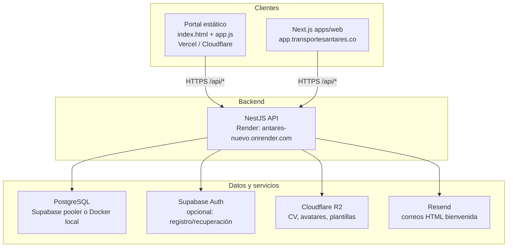

# Contexto del proyecto — Transportes Antares (monorepo)

Documento de referencia para desarrollo, despliegue y soporte. Complementa `README.md`, `DEPLOYMENT_RUNBOOK.md` y `BD/README.md`.

**Última actualización:** 2026-05-27.

---

## 1. Qué es este sistema

Plataforma operativa y de relación **B2B** para **Transportes Antares** (logística refrigerada y transporte especializado en Colombia). Cubre:

- Portal empresarial (clientes, solicitudes de transporte, viajes, flota).
- Gestión de usuarios con aprobación administrativa.
- RRHH: nómina, liquidaciones, vacantes, candidatos, contratos.
- Formularios públicos: contacto B2B y postulación a vacantes.
- Notificaciones, autorizaciones y parámetros legales (SMMLV, etc.).

**Fuentes de verdad en producción:** PostgreSQL (esquema en `BD/postgres`) + API NestJS. El portal estático usa `localStorage` como caché y sincroniza con la API (`/api/portal/sync-key`, bootstrap).

---

## 2. Arquitectura de despliegue



| Componente | URL / ubicación | Notas |
|------------|-----------------|--------|
| Sitio público + portal principal | `https://transportesantares.co`, `https://www.transportesantares.co` | Repo root en Vercel (`antares-static`), preset Other |
| App Next (opcional) | `https://app.transportesantares.co` | `apps/web`, `NEXT_PUBLIC_API_URL` con `/api` |
| API | `https://antares-nuevo.onrender.com` | Prefijo global `/api` |
| Base de datos | Supabase Postgres (Session pooler) o Docker local | Ver `docs/CONFIGURACION_SUPABASE_RENDER_POSTGRES.md` |

---

## 3. Estructura del monorepo

```
Antares Nuevo/
├── index.html, app.js, styles.css    # Portal estático (principal)
├── modules/                          # Dominios JS del portal (auth, trips, payroll…)
├── config/
│   ├── antares.public.js             # URL API (sin /api), origen portal público
│   └── supabase.public.js            # URL + anon key Supabase (público)
├── apps/
│   ├── api/                          # NestJS 10+, TypeScript
│   └── web/                          # Next.js (login demo / despliegue opcional)
├── BD/postgres/                      # Esquema, tablas, migraciones
├── docs/                             # Documentación técnica
├── qa/                               # Smoke y regresión estática
├── scripts/                          # setup, verify, ensure-dev-env
├── DEPLOYMENT_RUNBOOK.md             # Checklist producción
└── package.json                      # Workspaces: api, web
```

---

## 4. Frontends

### 4.1 Portal estático (principal)

- **Entrada:** `index.html` + `app.js`.
- **API:** `config/antares.public.js` → `window.__ANTARES_API_BASE__` (sin `/api`). El cliente llama `.../api/auth/login`, `.../api/portal/bootstrap`, etc.
- **Origen portal en correos/recuperación:** `window.__PORTAL_PUBLIC_ORIGIN__` (ej. `https://www.transportesantares.co`).
- **Supabase en navegador:** `config/supabase.public.js` (anon key; flujos de recuperación de contraseña).
- **Seguridad cliente:** `modules/core/runtime-security.js` reduce `console.*` en producción; la autorización real está en el servidor.

### 4.2 Next.js (`apps/web`)

- Variable: `NEXT_PUBLIC_API_URL=https://antares-nuevo.onrender.com/api` (**debe** terminar en `/api`).
- Uso secundario / demostración frente al portal estático.

---

## 5. API NestJS (`apps/api`)

### 5.1 Módulos

| Módulo | Ruta base | Responsabilidad |
|--------|-----------|-----------------|
| `AuthModule` | `/api/auth` | Registro, login JWT, refresh, recuperación contraseña |
| `PortalModule` | `/api/portal` | Bootstrap, sync-key, admin, flota, notificaciones |
| `PayrollModule` | `/api/payroll` | Colillas, liquidaciones automáticas |
| `B2bProspectModule` | `/api/public` | Vacantes públicas, contacto B2B, postulaciones |
| `UploadsModule` | `/api/uploads` | Presign R2, plantillas contrato |
| `FilesModule` | — | Supabase Storage (opcional) |
| `MailModule` | — | Resend (bienvenida registro) |

### 5.2 Autenticación y usuarios

- **JWT:** `JWT_ACCESS_SECRET`, `JWT_REFRESH_SECRET`, expiración `15m` / `7d` recomendados.
- **Registro portal:** `POST /api/auth/register-portal` → fila en `usuarios` con `estado_cuenta = pendiente`.
- **Login:** solo usuarios `estado_cuenta = aprobado` (admin debe aprobar vía `POST /api/portal/approve-pending-user` o BD).
- **Supabase Auth (opcional):** sincronización de usuario y correo de recuperación; requiere `SUPABASE_URL`, `SUPABASE_SERVICE_ROLE_KEY`.
- **Turnstile (opcional):** `CF_TURNSTILE_SECRET`, `CF_TURNSTILE_REQUIRED=true` en registro/login/recuperación.

### 5.3 Portal — flujo de datos

1. Tras login, `GET /api/portal/bootstrap` vuelca datos a claves `localStorage` (mapeo en `BD/README.md`).
2. Cambios del cliente → `POST /api/portal/sync-key` (por clave: `users`, `requests`, `vehicles`, etc.).
3. `PortalService.onModuleInit` aplica ALTER idempotentes si la BD de producción va detrás del código.

### 5.4 Endpoints públicos (sin JWT)

- `GET /api/public/vacancies`
- `GET /api/public/transport-request-coverage-stats`
- `POST /api/public/b2b-prospect`
- `POST /api/public/job-application` (multipart CV → R2)

---

## 6. Base de datos

- **Motor:** PostgreSQL 15+.
- **Scripts:** `BD/postgres/` — `01`–`10`, `tablas/` (un SQL por tabla). La carpeta `migrations/` documenta política; sin `.sql` incrementales.
- **Comandos:**

  | Comando | Uso |
  |---------|-----|
  | `npm run db:init` | BD vacía local (01–08) |
  | `npm run db:init:supabase` | Producción Supabase (01–10 + RLS) |
  | `npm run db:migrate` | Solo migraciones incrementales |

- **Tablas clave:** `usuarios`, `empresas`, `solicitudes_transporte`, `viajes_transporte`, `empleados_nomina`, `liquidaciones_nomina`, `prospectos_contacto_b2b`, `vacantes`, `candidatos`, etc. (30 tablas en `tablas/`).
- **Conexión Render → Supabase:** usar **Session pooler** con usuario `postgres.<PROJECT_REF>`, contraseña URL-encoded. Ver `docs/CONFIGURACION_SUPABASE_RENDER_POSTGRES.md`.

---

## 7. Correo (Resend)

### 7.1 Cuándo se envía

- Registro en portal → `MailService.sendPortalRegistrationWelcome` (HTML corporativo, estado pendiente/aprobado).
- Aprobación de usuario pendiente → mismo servicio con `accountApproved: true`.
- Fallback si Resend falla: intento con correo Supabase (magic link), si está configurado.

### 7.2 Variables de entorno

| Variable | Obligatorio | Descripción |
|----------|-------------|-------------|
| `RESEND_API_KEY` | Sí (para HTML propio) | Clave API `re_...` |
| `MAIL_FROM` | Recomendado | Identidad deseada; **una línea**. Ej. `Transportes Antares <antarestecnologia1@gmail.com>` |
| `RESEND_VERIFIED_FROM` | Producción | Remitente con dominio verificado en Resend |
| `PORTAL_PUBLIC_URL` | Recomendado | URL del botón en el correo |

### 7.3 Comportamiento actual del código (`mail.service.ts`)

1. **Normalización:** elimina `\r`, `\n` y espacios múltiples en `MAIL_FROM` / `RESEND_VERIFIED_FROM` (evita el error de Render con valor partido).
2. **Dominios públicos (gmail, hotmail, …):** no se usan como `From` en Resend; se envía con `RESEND_VERIFIED_FROM` o `onboarding@resend.dev` y **`replyTo`** = dirección de `MAIL_FROM`.
3. **Validación al arranque:** log de advertencia si Gmail está en `MAIL_FROM` sin dominio verificado.

### 7.4 Configuración recomendada en Render

```env
RESEND_API_KEY=re_xxxxxxxx
MAIL_FROM=Transportes Antares <antarestecnologia1@gmail.com>
RESEND_VERIFIED_FROM=Transportes Antares <notificaciones@transportesantares.co>
PORTAL_PUBLIC_URL=https://www.transportesantares.co
```

Pasos en Resend: verificar `transportesantares.co` (o `.com`) → **Verified** → usar esa dirección en `RESEND_VERIFIED_FROM`.

### 7.5 Plantillas Supabase Auth

Carpeta `BD/email_templates/` (recuperación de contraseña, invitaciones). Asuntos en `plantilla_asuntos.txt`.

---

## 8. Almacenamiento de archivos

### Cloudflare R2

| Variable | Uso |
|----------|-----|
| `CF_R2_ACCOUNT_ID` | Cuenta |
| `CF_R2_ACCESS_KEY_ID` / `CF_R2_SECRET_ACCESS_KEY` | Credenciales |
| `CF_R2_UPLOADS_BUCKET` | CV, avatares, **expediente documental RRHH** (`documentos_rrhh/…`) |
| `CF_R2_TEMPLATES_BUCKET` | Plantillas Word contratos |
| `CF_R2_PUBLIC_BASE` | URL pública opcional (no usar para cédulas; descarga vía URL prefirmada) |

**Gestión documental:** los archivos van a R2 en el bucket `CF_R2_UPLOADS_BUCKET`, prefijo `documentos_rrhh/{empleado_id}/{tipo}/`. Metadatos en Postgres (`documentos_empleado`). No requiere Supabase Storage.

Validación: `node apps/api/scripts/validate-r2.mjs`

Script: `npm run contracts:upload-r2` (sube desde `documentacion/`).

### Supabase Storage (opcional)

Buckets: `documentos_contratos`, `documentos_adjuntos`, `documentos_rrhh`. RLS en `BD/postgres/10_rls_storage_supabase.sql`.

---

## 9. Variables de entorno — referencia API

**Nunca commitear** `apps/api/.env` (gitignored). Generación local: `npm run setup`.

### Mínimas (login + registro)

- `DATABASE_URL`
- `JWT_ACCESS_SECRET`, `JWT_REFRESH_SECRET`
- `JWT_ACCESS_EXPIRES_IN`, `JWT_REFRESH_EXPIRES_IN`

### CORS

- `CORS_ORIGINS` — lista separada por comas si el origen no está en los defaults de `main.ts` (`transportesantares.co`, `*.vercel.app`, `*.pages.dev`).

### Supabase (opcional)

- `SUPABASE_URL`, `SUPABASE_SERVICE_ROLE_KEY`, `SUPABASE_ANON_KEY`
- `SUPABASE_AUTH_REQUIRE_EMAIL_CONFIRMATION`

### Correo

- Ver sección 7.

### Seguridad / captcha

- `CF_TURNSTILE_SECRET`, `CF_TURNSTILE_REQUIRED`

### Servidor

- `PORT` — Render lo inyecta; local `4000`.

---

## 10. Desarrollo local

```bash
npm install
npm run setup              # crea apps/api/.env si no existe
docker compose up -d       # Postgres local (opcional)
npm run db:ready
npm run db:init
npm run dev:api            # http://localhost:4000/api
# Portal: Live Server u otro en :5500 (CORS permitido)
```

Verificación sin Docker: `npm run verify`.

Con Docker + smoke API: `npm run verify:stack`.

---

## 11. Calidad y pruebas

| Script | Descripción |
|--------|-------------|
| `npm run test:portal-qa` | Regresión estática portal |
| `npm run test:reports-qa` | Smoke reportes |
| `npm run test:portal-e2e` | Playwright |
| `npm run smoke:api` | Salud API |
| `qa/portal-form-smoke.mjs` | Formularios |

---

## 12. Dominios de negocio (portal `modules/`)

Registro en `modules/domain-bootstrap.js`: `auth`, `users`, `companies`, `vehicles`, `drivers`, `trips`, `requests`, `notifications`, `payroll`, `recruitment`, `files`.

Vistas del portal estático en `modules/portal/views/` (registran `AppModules`); Next.js en `apps/web/app/`.

---

## 13. Documentos relacionados

| Archivo | Contenido |
|---------|-----------|
| `DEPLOYMENT_RUNBOOK.md` | DNS Cloudflare, Render, Vercel, checklist, Resend en Render |
| `BD/README.md` | Esquema SQL, mapa módulo ↔ tabla ↔ localStorage |
| `docs/CONFIGURACION_SUPABASE_RENDER_POSTGRES.md` | Pooler Supabase + Render |
| `apps/api/SECURITY.md` | Notas de seguridad API |
| `BD/reglas_negocio.md` | Reglas de negocio (si existe en el repo) |

---

## 14. Incidencias conocidas y lecciones

### Resend: `Domain not verified: gmail.com`

- **Síntoma:** POST `/emails` falla; en el log `from` aparece truncado (`antarestecnologia1@` + salto de línea).
- **Causa:** `MAIL_FROM` mal pegado en Render y/o intento de enviar desde Gmail.
- **Solución:** una línea completa en `MAIL_FROM`; verificar dominio corporativo; `RESEND_VERIFIED_FROM` para el `From` real; redeploy API.

### Login tras registro

- Usuario queda `pendiente` hasta aprobación admin → comportamiento esperado.

### Render free tier

- El servicio puede dormir; primer request lento.

### Cambio de URL de API

- Actualizar: Render, `config/antares.public.js`, `apps/web/.env.production`, `CORS_ORIGINS` si aplica.

---

## 15. Contacto operativo (referencia)

- **Empresa:** Transportes Antares — operador logístico B2B.
- **Dominios web:** `transportesantares.co`, portal en `www`.
- **Correo operativo documentado en despliegue:** `antarestecnologia1@gmail.com` (Reply-To / contacto; remitente Resend = dominio verificado).

---

*Para cambios de este documento, mantener sincronizada la sección de correo con `DEPLOYMENT_RUNBOOK.md` y `apps/api/src/mail/mail.service.ts`.*
