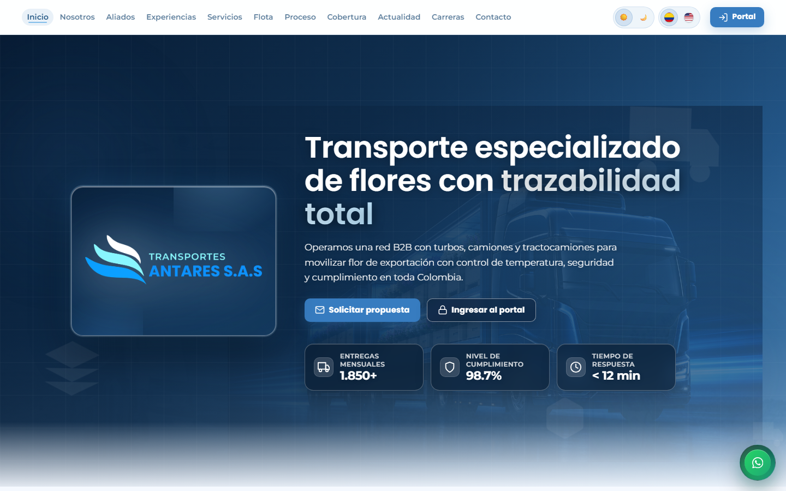
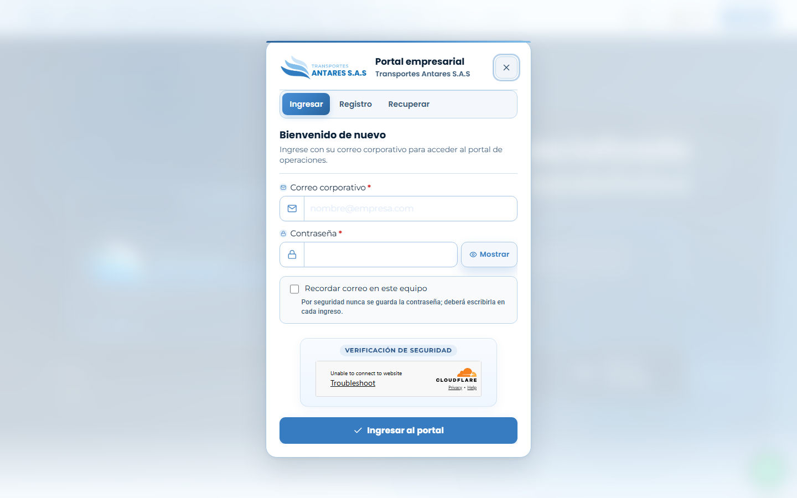
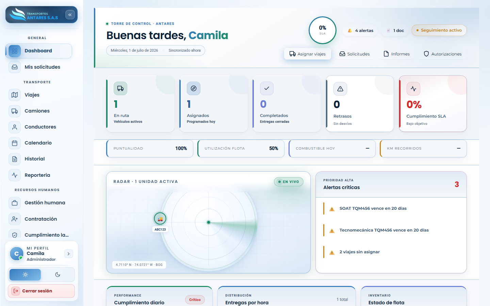

# Manual de usuario — Portal Transportes Antares S.A.S

## Introducción general

Bienvenido al manual de usuario del **Portal empresarial de Transportes Antares S.A.S**. Esta guía explica, módulo por módulo, cómo usar el portal: qué hace cada pantalla, qué botones y campos contiene, y los pasos exactos para completar las tareas más comunes (registrar, consultar, editar, filtrar y exportar información).

El portal es la herramienta de trabajo diario para:

- **Clientes B2B** (floricultoras y exportadoras) que radican y siguen sus solicitudes de transporte.
- **Equipo de operaciones/administración** de Antares, que asigna viajes, administra la flota y los conductores.
- **Equipo de Recursos Humanos (RRHH)**, que gestiona nómina, contratación y cumplimiento laboral/SST.
- **Administradores del sistema**, que gestionan usuarios, permisos y aprobaciones.

> Las capturas de pantalla de este manual corresponden a una sesión de demostración con datos de ejemplo. Los nombres de empresas, personas y cifras son ficticios; la disposición de menús, botones y campos es la real del portal.

---

## 1. Cómo ingresar al portal

1. Abra el sitio público de Transportes Antares en su navegador (`https://www.transportesantares.co` o el dominio que le indique la empresa).
2. En la esquina superior derecha, pulse el botón **«Portal»** (o **«Ingresar al portal»** en el banner principal).

3. Se abre la ventana **«Portal empresarial»**. En la pestaña **Ingresar**, escriba su correo y contraseña registrados y pulse **Ingresar**.
   - Si aún no tiene cuenta, use la pestaña **Registrarse** para solicitar acceso; un administrador deberá **aprobar** la cuenta antes de que pueda iniciar sesión (ver el manual de [Usuarios y permisos](./13-usuarios-permisos.md)).
   - Si olvidó su contraseña, use la opción **¿Olvidó su contraseña?** dentro del mismo modal.

4. Al validar sus credenciales, el portal lo llevará directamente al **Dashboard**.

---

## 2. Elementos comunes de la pantalla

Todas las pantallas del portal comparten la misma estructura general (ver captura):

| Elemento | Descripción |
|---|---|
| **Menú lateral (izquierda)** | Agrupa los módulos por sección: **General**, **Transporte**, **Recursos humanos** y **Sistema**. Haga clic en cualquier ítem para cambiar de módulo. El botón ««» en la esquina superior contrae o expande el menú para ganar espacio. |
| **Tarjeta de sesión** | En la parte baja del menú aparece su nombre, rol (Administrador, Cliente, RRHH, etc.) y el acceso directo a **Mi perfil**. Debajo están el interruptor de **modo claro/oscuro** y el botón **Cerrar sesión**. |
| **Encabezado del módulo** | Título de la pantalla activa, indicadores clave (KPI) en tarjetas y, en la mayoría de módulos, los botones **Registrar** (crear) y **Consultar** (ver listado/filtros). |
| **Pestañas «Registrar» / «Consultar»** | Varios módulos (Solicitudes, Viajes, Camiones, Gestión humana, Contratación) organizan el contenido en dos pestañas: **Registrar** (formularios de alta) y **Consultar** (listados, filtros, edición). |
| **Buscador y filtros** | Casi todas las pantallas de listado incluyen un cuadro de búsqueda libre y filtros por estado, fecha, empresa, etc. |
| **Acciones por fila/tarjeta** | Los botones **Ver, Editar, Eliminar** (u otros específicos del módulo) aparecen en cada tarjeta o fila de la tabla. |
| **Notificaciones** | La campana de notificaciones (menú **Notificaciones**) resume avisos del sistema: nuevas solicitudes, vencimientos de documentos, aprobaciones pendientes, etc. |
| **Mensajes emergentes (toasts)** | Al guardar, editar o eliminar un registro, el portal muestra un aviso emergente de éxito o error en la esquina de la pantalla. |

---

## 3. Roles y qué ve cada uno

El menú y los botones que ve cada usuario dependen de su **rol** y sus **permisos**:

| Rol | Acceso típico |
|---|---|
| **Cliente** | Dashboard, Mis solicitudes, Notificaciones, Mi perfil. Ve únicamente la información de su propia empresa. |
| **Administrador** | Acceso completo a todos los módulos, incluida la administración de usuarios y permisos. |
| **RRHH / Auxiliar administrativo** | Gestión humana, Contratación, Cumplimiento laboral y SST, además de los módulos generales. |
| **Operación / Logística** | Transporte (Viajes, Camiones, Conductores, Calendario, Historial, Reportería), Solicitudes. |

Un administrador puede afinar el acceso caso por caso desde **Usuarios y permisos → Asignar permisos** (ver ese manual para el detalle de cada permiso disponible).

---

## 4. Índice de manuales por módulo

1. [Dashboard](./01-dashboard.md)
2. [Mis solicitudes](./02-solicitudes.md)
3. [Transporte · Viajes](./03-viajes.md)
4. [Transporte · Camiones](./04-camiones.md)
5. [Transporte · Conductores](./05-conductores.md)
6. [Transporte · Calendario](./06-calendario.md)
7. [Historial y trazabilidad](./07-historial.md)
8. [Centro de reportería](./08-reporteria.md)
9. [Gestión humana](./09-gestion-humana.md)
10. [Contratación](./10-contratacion.md)
11. [Cumplimiento laboral y SST](./11-cumplimiento-laboral.md)
12. [Contacto web (B2B)](./12-contacto-b2b.md)
13. [Usuarios y permisos](./13-usuarios-permisos.md)
14. [Centro de aprobaciones (Autorizaciones)](./14-autorizaciones.md)
15. [Notificaciones](./15-notificaciones.md)
16. [Mi perfil](./16-mi-perfil.md)

---

## 5. Buenas prácticas generales

- **Guarde siempre desde el botón de acción** de cada formulario (por ejemplo, «Registrar vehículo», «Guardar cambios»); cerrar la ventana sin guardar descarta los cambios.
- **Revise los campos marcados con asterisco (`*`)**: son obligatorios y el portal no permite guardar si faltan o tienen un formato inválido (documento, teléfono, fechas, etc.).
- **Use los filtros rápidos** (pastillas de estado, buscador) antes de desplazarse por listados largos.
- **Consulte el Centro de aprobaciones** periódicamente si es administrador: allí llegan las altas de usuarios, conductores y vehículos que otros roles no pueden crear directamente.
- **Cierre sesión** al terminar, especialmente en equipos compartidos.
