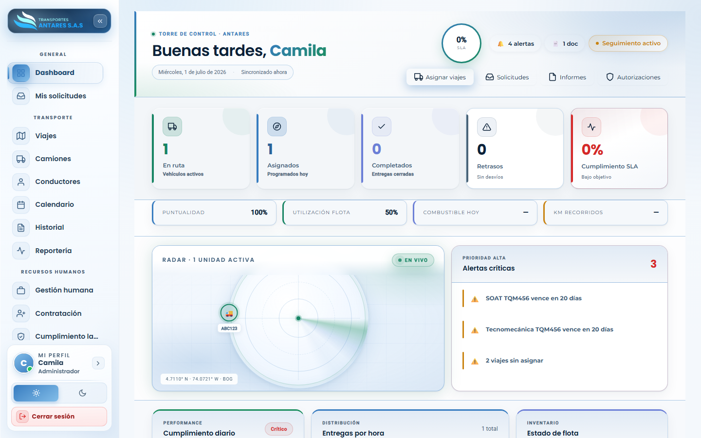

# Manual de usuario — Dashboard

[⬅ Volver al índice](./00-introduccion.md)

## 1. Objetivo del módulo

El **Dashboard** es la pantalla de inicio del portal. Ofrece una vista consolidada del estado operativo del día: viajes en curso, solicitudes pendientes, alertas críticas (documentos por vencer, retrasos) y accesos directos a las tareas más frecuentes.

**A quién va dirigido:** todos los roles lo ven al iniciar sesión, con información ajustada a su alcance (un cliente ve solo sus propios viajes/solicitudes; un administrador ve el consolidado de toda la operación).

**Acceso:** menú lateral → **General → Dashboard** (también es la pantalla que se muestra automáticamente después de iniciar sesión).

## 2. Vista general

La pantalla se organiza en bloques:

1. **Encabezado de bienvenida** — saludo personalizado, fecha y hora de sincronización, indicador de **SLA** (cumplimiento de niveles de servicio) y accesos rápidos: **Asignar viajes**, **Solicitudes**, **Informes**, **Autorizaciones**.
2. **Tarjetas de indicadores (KPI)** — en ruta, asignados hoy, completados, retrasos y % de cumplimiento SLA.
3. **Barra de métricas secundarias** — puntualidad, utilización de flota, combustible del día y kilómetros recorridos.
4. **Radar de flota en vivo** — mapa esquemático con la posición de las unidades activas.
5. **Alertas críticas** — lista priorizada de pendientes: documentos por vencer (SOAT, tecnomecánica), viajes sin asignar, etc.
6. **Paneles inferiores** (al desplazarse hacia abajo) — cumplimiento diario, distribución de entregas por hora e inventario del estado de la flota.

## 3. Pasos: uso diario del Dashboard

1. **Revise las alertas críticas** al iniciar el día: haga clic sobre cualquier alerta para ir directo al módulo relacionado (por ejemplo, un vencimiento de SOAT lo lleva a **Camiones**).
2. **Use los accesos rápidos** del encabezado para saltar directamente a **Asignar viajes**, **Solicitudes**, **Informes** o **Autorizaciones** sin pasar por el menú lateral.
3. **Consulte el radar de flota** para ver, de un vistazo, cuántas unidades están activas y su ubicación aproximada.
4. **Verifique el cumplimiento SLA** y la puntualidad; un valor bajo (en rojo) indica que se deben revisar los viajes en curso desde el módulo **Viajes**.

## 4. Preguntas frecuentes

- **¿Por qué mi Dashboard muestra menos información que el de un compañero?** El contenido depende del rol y los permisos asignados; un cliente solo ve datos de su propia empresa.
- **¿Con qué frecuencia se actualiza la información?** El encabezado indica «Sincronizado ahora»; el portal actualiza los indicadores automáticamente al navegar y de forma periódica en segundo plano.
- **¿Puedo personalizar las tarjetas del Dashboard?** El diseño de este panel es fijo; para reportes personalizables use el módulo [Centro de reportería](./08-reporteria.md).

---
[⬅ Volver al índice](./00-introduccion.md) · [Siguiente: Mis solicitudes ➡](./02-solicitudes.md)
