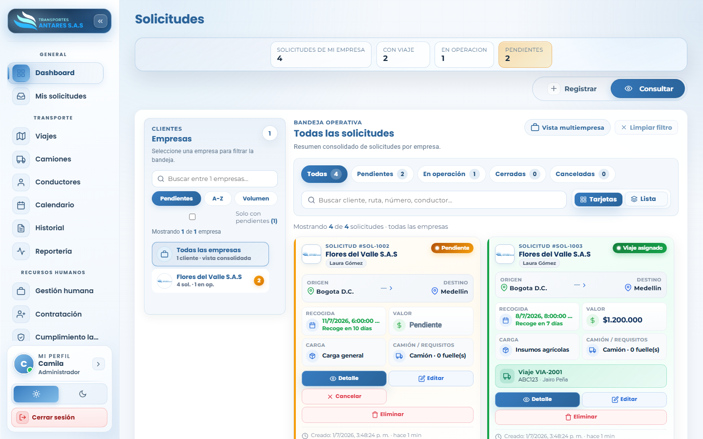
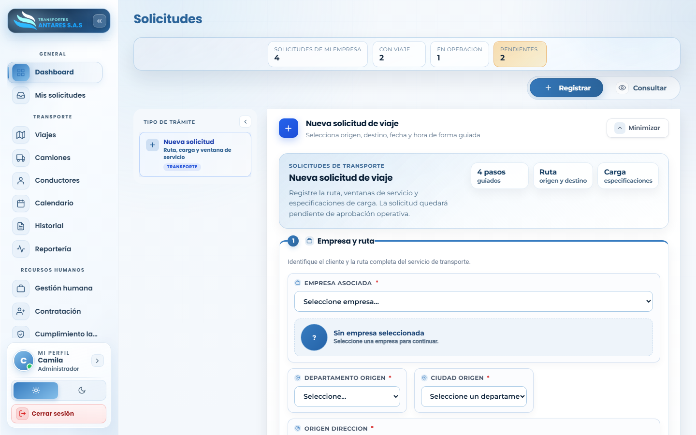
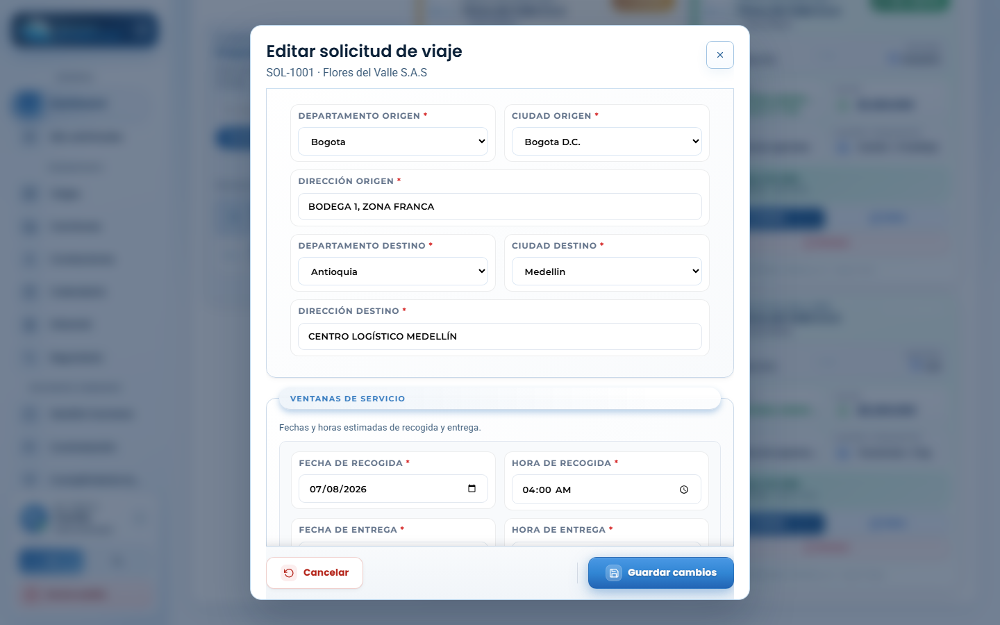

# Manual de usuario — Mis solicitudes

[⬅ Volver al índice](./00-introduccion.md)

## 1. Objetivo del módulo

Este módulo permite **radicar nuevas solicitudes de transporte** (origen, destino, carga, ventanas de fecha/hora) y **hacerles seguimiento** hasta que se conviertan en un viaje asignado y se cierren. Es el punto de entrada de toda operación de transporte en el portal.

**A quién va dirigido:** clientes B2B (para crear y consultar sus propias solicitudes) y al equipo de operaciones de Antares (para revisar, filtrar y dar trámite a las solicitudes de todos los clientes).

**Acceso:** menú lateral → **General → Mis solicitudes**.

## 2. Vista general — Consultar

- **Tarjetas de resumen**: total de solicitudes de la empresa, cuántas ya tienen viaje asignado, cuántas están «en operación» y cuántas «pendientes».
- **Panel de clientes/empresas** (visible para operación/administración): permite filtrar la bandeja por una empresa específica o ver todas.
- **Bandeja operativa**: pestañas rápidas **Todas / Pendientes / En operación / Cerradas / Canceladas**, buscador libre y alternador de vista **Tarjetas / Lista**.
- **Tarjeta de solicitud**: muestra número de solicitud, cliente, origen → destino, fecha/hora de recogida, valor del viaje, tipo de carga/camión y, si ya tiene viaje asignado, el número de viaje y el conductor. Incluye los botones **Detalle**, **Editar**, **Cancelar/Eliminar**.

## 3. Paso a paso: crear una nueva solicitud

1. Vaya a **Mis solicitudes** y pulse la pestaña **Registrar** (o el botón **+ Registrar**).
2. Se abre el asistente **Nueva solicitud de viaje**, de 4 pasos guiados: **Empresa y ruta**, **Ventanas de servicio**, **Carga** y **Contacto en sitio**.

3. **Paso 1 — Empresa y ruta**: seleccione la empresa asociada (si aplica) y complete departamento/ciudad/dirección de origen y destino.
4. **Paso 2 — Ventanas de servicio**: indique fecha y hora estimadas de recogida y de entrega.
5. **Paso 3 — Carga**: describa la carga, indique si requiere termoking/refrigeración y el tipo de camión requerido.
6. **Paso 4 — Contacto en sitio**: nombre y teléfono de la persona de contacto en el punto de cargue, y notas adicionales.
7. Pulse **Registrar solicitud** (botón azul al final del formulario). La solicitud queda en estado **Pendiente**, a la espera de que operaciones le asigne un viaje.

## 4. Paso a paso: editar una solicitud existente

1. En la pestaña **Consultar**, ubique la solicitud (use el buscador o los filtros de estado).
2. Pulse **Editar** en la tarjeta correspondiente.

3. Se abre la ventana **Editar solicitud de viaje** con los datos actuales: origen, destino, ventanas de servicio, carga, etc.
4. Modifique los campos necesarios y pulse **Guardar cambios**.

> Una solicitud que ya tiene un viaje asignado puede editarse igualmente (por ejemplo, para actualizar la dirección), pero los cambios al viaje en sí (vehículo, conductor, fechas del viaje) se gestionan desde el módulo [Transporte · Viajes](./03-viajes.md).

## 5. Otras acciones disponibles

- **Cancelar una solicitud**: botón **Cancelar** en la tarjeta (solo disponible mientras la solicitud está pendiente).
- **Eliminar una solicitud**: botón **Eliminar**; pide confirmación antes de borrar el registro.
- **Ver detalle completo**: botón **Detalle** para abrir una ficha de solo lectura con toda la información de la solicitud y, si existe, del viaje asociado.
- **Filtrar por empresa** (rol operación/admin): panel izquierdo **Clientes** — permite ver «Todas las empresas» (consolidado) o una empresa puntual.

## 6. Preguntas frecuentes

- **¿Qué pasa después de registrar una solicitud?** Queda en estado **Pendiente** hasta que el equipo de operaciones le asigna vehículo y conductor desde **Transporte · Viajes**, momento en el que pasa a **Viaje asignado**.
- **¿Puedo ver solicitudes de otras empresas?** Solo si su rol tiene permiso de vista multiempresa (administración/operación). Los clientes solo ven las solicitudes de su propia empresa.
- **¿Cómo sé si mi solicitud fue aprobada?** Revise el estado en la tarjeta o consulte el módulo [Notificaciones](./15-notificaciones.md).

---
[⬅ Anterior: Dashboard](./01-dashboard.md) · [⬅ Volver al índice](./00-introduccion.md) · [Siguiente: Transporte · Viajes ➡](./03-viajes.md)
