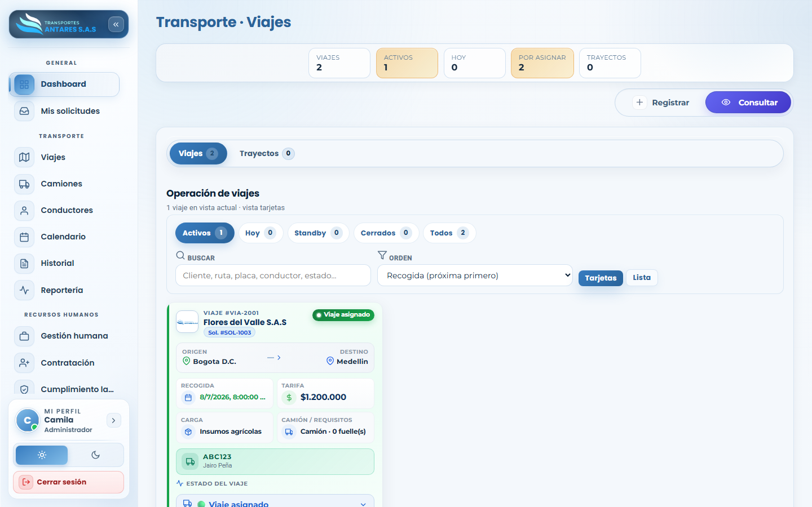
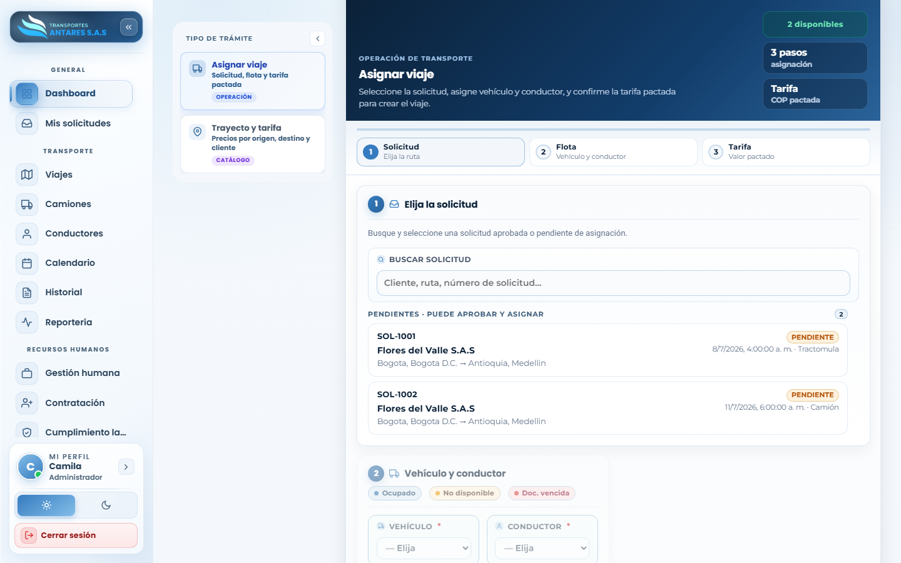
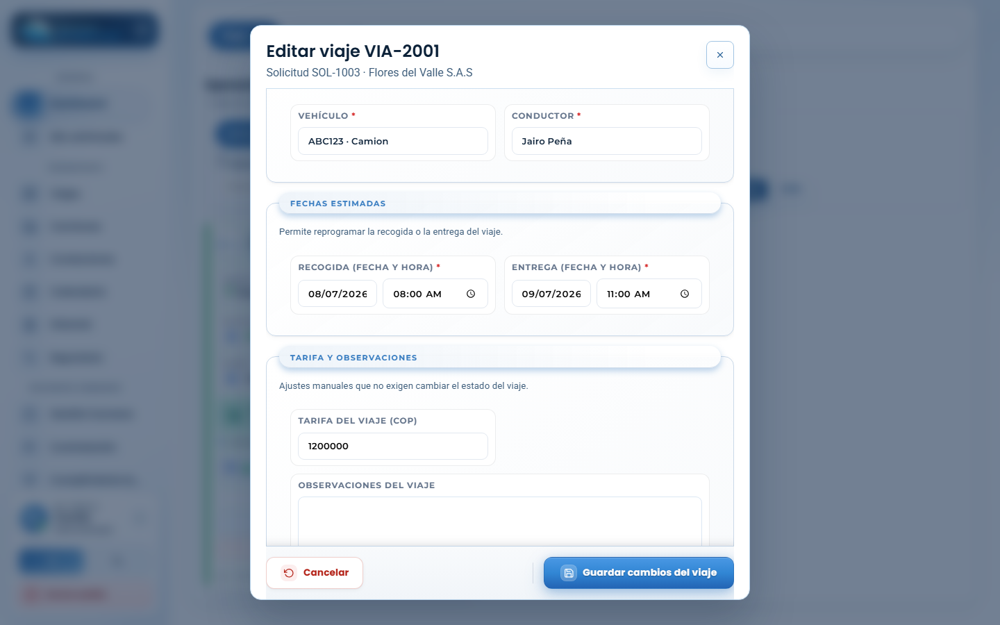

# Manual de usuario — Transporte · Viajes

[⬅ Volver al índice](./00-introduccion.md)

## 1. Objetivo del módulo

Este módulo es el corazón operativo del transporte: permite **convertir solicitudes aprobadas en viajes asignados** (asignando vehículo, conductor y tarifa) y **hacer seguimiento** al viaje hasta su cierre. También administra los **trayectos y tarifas** de referencia por ruta.

**A quién va dirigido:** equipo de operaciones/logística y administradores.

**Acceso:** menú lateral → **Transporte → Viajes**.

## 2. Vista general — Consultar

- **Tarjetas de resumen**: total de viajes, viajes activos, programados para hoy, solicitudes por asignar y trayectos configurados.
- **Pestañas**: **Viajes** (operación) y **Trayectos** (catálogo de rutas/tarifas).
- **Filtros rápidos**: Activos, Hoy, Standby, Cerrados, Todos; buscador por cliente, ruta, placa, conductor o estado; orden por fecha de recogida.
- **Tarjeta de viaje**: número de viaje, cliente, solicitud de origen, ruta, fecha/hora de recogida, tarifa pactada, tipo de carga/camión, vehículo y conductor asignados, y el estado actual del viaje.

## 3. Paso a paso: asignar un viaje a una solicitud

1. Vaya a **Viajes → Registrar** (o pulse **+ Registrar**). Se abre el asistente **Asignar viaje**, de 3 pasos: **Solicitud**, **Flota** y **Tarifa**.

2. **Paso 1 — Solicitud**: busque y seleccione la solicitud pendiente que desea atender (se muestran las solicitudes aprobadas o pendientes de asignación, con cliente y ruta).
3. **Paso 2 — Flota**: elija el **vehículo** y el **conductor** disponibles para esa ruta y fecha. El sistema resalta los recursos ocupados, no disponibles o con documentación vencida para evitar asignaciones incorrectas.
4. **Paso 3 — Tarifa**: confirme el valor pactado del viaje (COP).
5. Pulse **Crear viaje**. La solicitud pasa a estado **Viaje asignado** y aparece en la bandeja de viajes activos.

## 4. Paso a paso: editar un viaje

1. En la pestaña **Consultar**, ubique el viaje y pulse **Editar** en su tarjeta.

2. En la ventana **Editar viaje** puede:
   - Cambiar el **vehículo** y/o el **conductor** asignados.
   - Reprogramar las **fechas y horas** de recogida y entrega.
   - Ajustar la **tarifa** y agregar **observaciones** del viaje.
3. Pulse **Guardar cambios del viaje**.

## 5. Trayectos y tarifas

En la pestaña **Trayectos** se administra el catálogo de rutas frecuentes (origen–destino) con su tarifa de referencia, útil para agilizar la asignación de nuevos viajes y mantener consistencia de precios.

## 6. Preguntas frecuentes

- **¿Por qué no puedo seleccionar cierto vehículo o conductor?** Porque ya está asignado a otro viaje en ese horario, está marcado como no disponible, o tiene documentos vencidos (SOAT, tecnomecánica, licencia). Revise [Camiones](./04-camiones.md) o [Conductores](./05-conductores.md).
- **¿Cómo cierro un viaje completado?** El cierre se refleja actualizando el estado del viaje/solicitud; consulte también [Historial y trazabilidad](./07-historial.md) para ver el registro de cambios.
- **¿Dónde veo todos los viajes en un calendario?** Use el módulo [Transporte · Calendario](./06-calendario.md).

---
[⬅ Anterior: Mis solicitudes](./02-solicitudes.md) · [⬅ Volver al índice](./00-introduccion.md) · [Siguiente: Transporte · Camiones ➡](./04-camiones.md)
