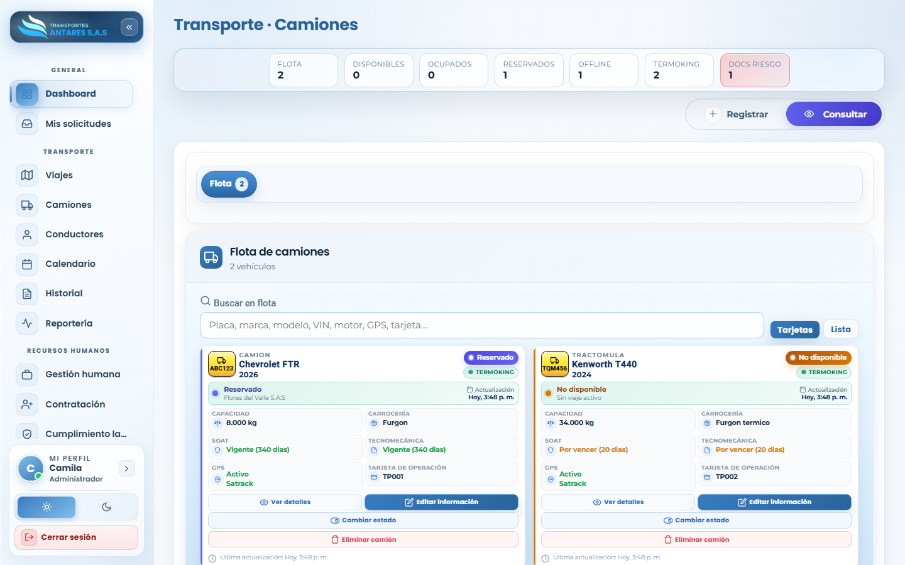
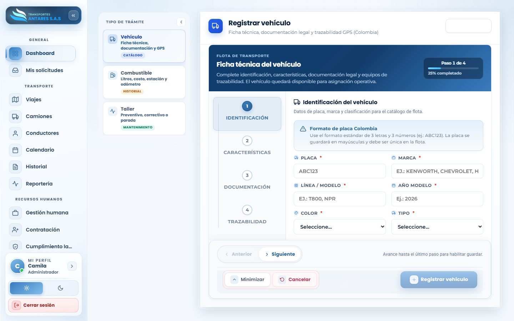
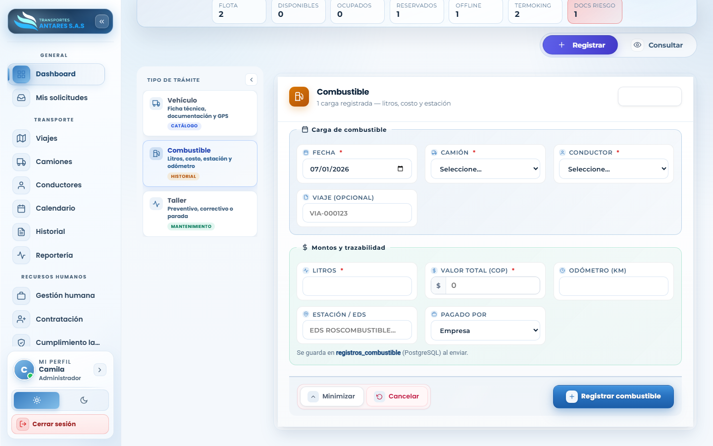
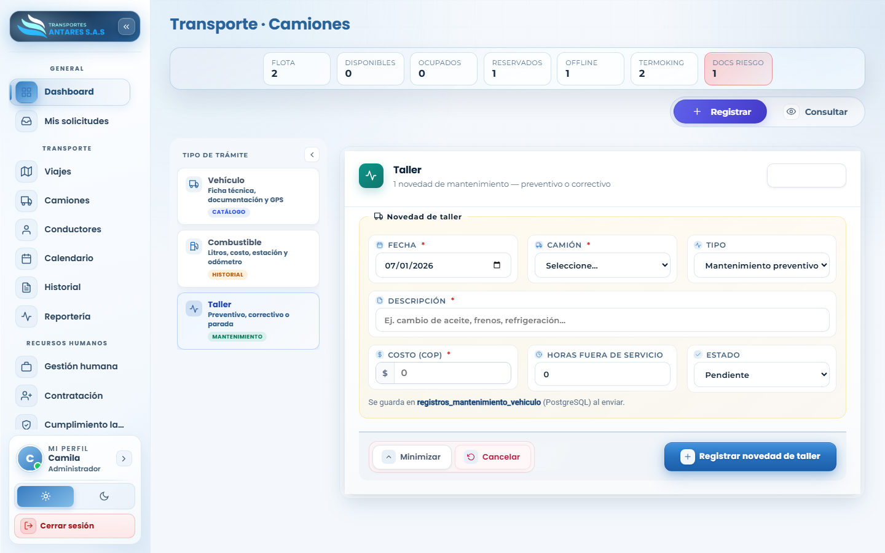

# Manual de usuario — Transporte · Camiones

[⬅ Volver al índice](./00-introduccion.md)

## 1. Objetivo del módulo

Administra el **catálogo de la flota de vehículos**: ficha técnica, documentación legal (SOAT, tecnomecánica, pólizas), GPS, disponibilidad, y los registros históricos de **combustible** y **mantenimiento (taller)**.

**A quién va dirigido:** equipo de operaciones/flota y administradores.

**Acceso:** menú lateral → **Transporte → Camiones**.

## 2. Vista general — Consultar

- **Tarjetas de resumen**: total de flota, disponibles, ocupados, reservados, offline, con termoking y con documentos en riesgo (por vencer o vencidos).
- **Buscador**: por placa, marca, modelo, VIN, motor, proveedor GPS o tarjeta de operación.
- **Tarjeta de vehículo**: placa, marca/modelo/año, estado (Disponible, Reservado, No disponible), capacidad, carrocería, estado del SOAT y tecnomecánica (con días restantes), GPS y tarjeta de operación. Incluye los botones **Ver detalles**, **Editar información**, **Cambiar estado** y **Eliminar camión**.

## 3. Paso a paso: registrar un vehículo nuevo

1. Vaya a **Camiones → Registrar**. En el panel **Tipo de trámite**, seleccione **Vehículo**.
2. Complete el asistente de **Ficha técnica del vehículo**, organizado en 4 pasos:

   - **Paso 1 — Identificación**: placa (formato colombiano, 3 letras + 3 números), marca, línea/modelo, año y color.
   - **Paso 2 — Características**: tipo de vehículo, carrocería, capacidad de carga (kg), configuración de ejes, si es refrigerado, etc.
   - **Paso 3 — Documentación**: números de motor y VIN, tarjeta de propiedad, fechas de expedición y vencimiento de SOAT y tecnomecánica, y pólizas de responsabilidad civil.
   - **Paso 4 — Trazabilidad**: si cuenta con GPS, proveedor y credenciales de seguimiento.
3. Pulse **Registrar vehículo** en el último paso. El vehículo queda disponible en el catálogo de flota.

## 4. Paso a paso: registrar un consumo de combustible

1. Vaya a **Camiones → Registrar** y, en **Tipo de trámite**, seleccione **Combustible**.

2. Complete la fecha, el camión y el conductor, y opcionalmente el número de viaje asociado.
3. Indique los litros cargados, el valor total (COP), el kilometraje del odómetro, la estación de servicio y quién pagó (empresa o conductor).
4. Pulse **Registrar combustible**. El consumo queda disponible para reportes de eficiencia de flota.

## 5. Paso a paso: registrar una novedad de taller

1. Vaya a **Camiones → Registrar** y, en **Tipo de trámite**, seleccione **Taller**.

2. Seleccione el camión, la fecha y el **tipo de mantenimiento** (preventivo o correctivo).
3. Describa la novedad, el costo (COP), las horas fuera de servicio y el estado (pendiente, en proceso, completado).
4. Pulse **Registrar novedad de taller**.

## 6. Editar o dar de baja un vehículo

1. En la pestaña **Consultar**, ubique el vehículo y pulse **Editar información** para actualizar sus datos, o **Cambiar estado** para marcarlo disponible/no disponible.
2. Use **Eliminar camión** para retirarlo del catálogo (acción irreversible; requiere confirmación).

## 7. Preguntas frecuentes

- **¿Qué significa la etiqueta «Docs riesgo»?** Indica cuántos vehículos tienen SOAT, tecnomecánica o pólizas próximas a vencer o ya vencidas; revíselos cuanto antes para evitar sanciones u operación irregular.
- **¿Puedo asignar un vehículo con documentos vencidos a un viaje?** El módulo [Transporte · Viajes](./03-viajes.md) alerta sobre esta condición antes de confirmar la asignación.
- **¿Dónde veo el historial de combustible y mantenimiento de un vehículo?** En la ficha de **Ver detalles** del vehículo, o de forma consolidada en [Centro de reportería](./08-reporteria.md).

---
[⬅ Anterior: Transporte · Viajes](./03-viajes.md) · [⬅ Volver al índice](./00-introduccion.md) · [Siguiente: Transporte · Conductores ➡](./05-conductores.md)
