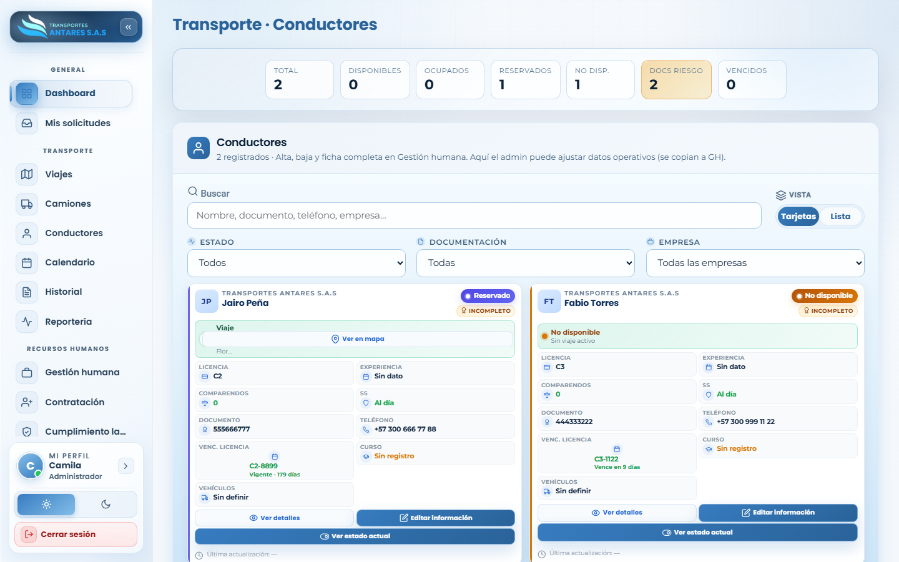
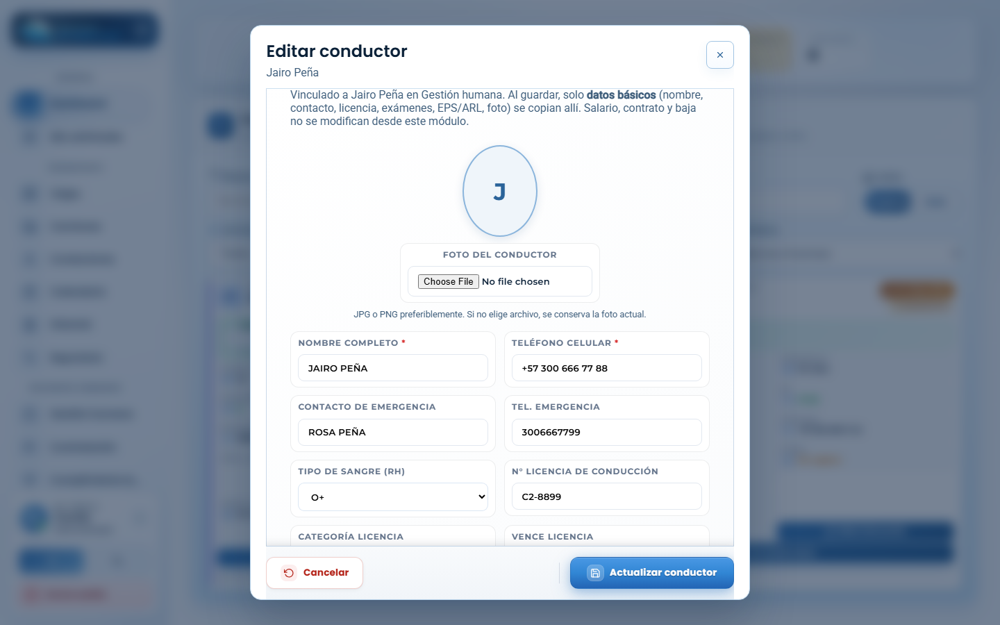

# Manual de usuario — Transporte · Conductores

[⬅ Volver al índice](./00-introduccion.md)

## 1. Objetivo del módulo

Muestra la ficha **operativa** de cada conductor: licencia de conducción, disponibilidad, vehículo asignado, estado de sus documentos y viaje activo (si tiene uno en curso).

> **Importante:** el alta y la baja del conductor (contratación, ficha completa, EPS/ARL, contrato) se gestionan desde **[Gestión humana](./09-gestion-humana.md)**, dando de alta un colaborador con cargo «Conductor». Este módulo permite **ajustar datos operativos** (licencia, teléfono, foto, vehículo asignado); los cambios de datos básicos se sincronizan automáticamente con la ficha de Gestión humana.

**A quién va dirigido:** equipo de operaciones/flota y administradores.

**Acceso:** menú lateral → **Transporte → Conductores**.

## 2. Vista general

- **Tarjetas de resumen**: total de conductores, disponibles, ocupados, reservados, no disponibles, con documentos en riesgo y con licencia vencida.
- **Buscador y filtros**: por nombre/documento/teléfono/empresa, por estado y por vigencia de documentación.
- **Vista Tarjetas / Lista**: alterna la presentación del listado.
- **Tarjeta de conductor**: nombre, empresa, categoría y vencimiento de licencia, teléfono, estado de seguridad social (EPS/ARL), curso vigente, vehículo asignado y, si tiene un viaje activo, el botón **Ver en mapa**. Incluye **Ver detalles**, **Editar información** y **Ver estado actual**.

## 3. Paso a paso: editar la ficha operativa de un conductor

1. Ubique al conductor en el listado (use el buscador o los filtros de estado/documentación).
2. Pulse **Editar información** en su tarjeta.

3. En la ventana **Editar conductor** puede actualizar:
   - Foto del conductor.
   - Nombre completo y teléfono celular.
   - Contacto de emergencia y teléfono.
   - Tipo de sangre (RH).
   - Número, categoría y vencimiento de la licencia de conducción.
4. Pulse **Actualizar conductor**. Los cambios de datos básicos se reflejan también en la ficha del colaborador en **Gestión humana**.

## 4. Otras acciones disponibles

- **Ver detalles**: abre la ficha completa de solo lectura del conductor.
- **Ver estado actual**: muestra el estado operativo vigente (disponible, en viaje, etc.).
- **Ver en mapa**: si el conductor tiene un viaje activo, ubica su posición aproximada.

## 5. Preguntas frecuentes

- **¿Cómo doy de alta un conductor nuevo?** Regístrelo como colaborador desde **[Gestión humana → Registrar → Empleado](./09-gestion-humana.md)**, seleccionando el cargo «Conductor». Aparecerá automáticamente en este listado.
- **¿Por qué un conductor aparece «No disponible»?** Puede estar asignado a un viaje en curso o haber sido marcado manualmente como no disponible; revise su ficha o el módulo [Transporte · Viajes](./03-viajes.md).
- **¿Qué significa la etiqueta «Incompleto»?** Indica que faltan datos operativos o documentos por completar en la ficha del conductor.

---
[⬅ Anterior: Transporte · Camiones](./04-camiones.md) · [⬅ Volver al índice](./00-introduccion.md) · [Siguiente: Transporte · Calendario ➡](./06-calendario.md)
