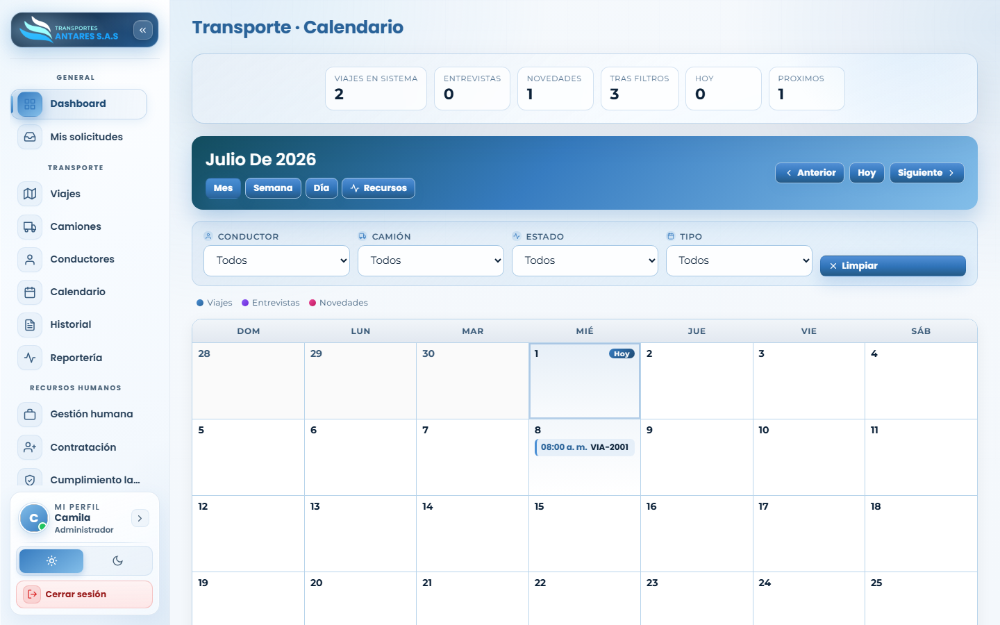
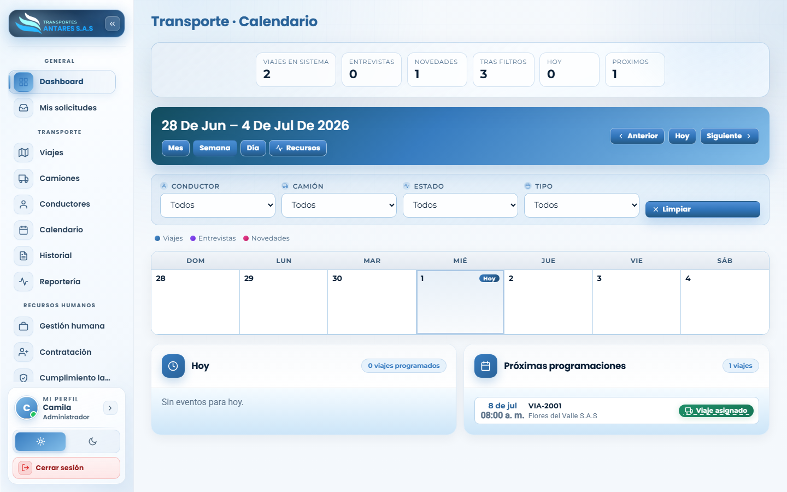

# Manual de usuario — Transporte · Calendario

[⬅ Volver al índice](./00-introduccion.md)

## 1. Objetivo del módulo

Presenta en formato de **calendario** todos los viajes programados, entrevistas de contratación y novedades (ausencias, mantenimientos), para tener una visión temporal de la operación y evitar cruces de agenda.

**A quién va dirigido:** equipo de operaciones/logística y administradores.

**Acceso:** menú lateral → **Transporte → Calendario**.

## 2. Vista general — Mes

- **Tarjetas de resumen**: viajes en sistema, entrevistas, novedades, resultados tras filtros, eventos de hoy y próximos eventos.
- **Selector de vista**: **Mes**, **Semana**, **Día** y **Recursos**.
- **Navegación**: botones **Anterior**, **Hoy** y **Siguiente** para moverse en el tiempo.
- **Filtros**: por conductor, camión, estado y tipo de evento.
- **Leyenda de colores**: Viajes, Entrevistas, Novedades — cada tipo de evento se distingue por color en las celdas del calendario.

## 3. Paso a paso: consultar la agenda de la semana

1. Seleccione la vista **Semana** en la barra de navegación.

2. Use **Anterior / Siguiente** para moverse entre semanas, o **Hoy** para volver a la fecha actual.
3. Revise los paneles **Hoy** y **Próximas programaciones** para ver el detalle de los eventos: número de viaje, hora, cliente y estado.
4. Aplique los filtros de **conductor**, **camión**, **estado** o **tipo** si necesita acotar la vista a un recurso específico.

## 4. Otras acciones disponibles

- **Vista Día**: para revisar la agenda hora por hora de una fecha puntual.
- **Vista Recursos**: organiza los eventos por conductor/vehículo en lugar de por fecha.
- **Limpiar filtros**: botón para restablecer todos los filtros aplicados.

## 5. Preguntas frecuentes

- **¿Puedo crear un viaje directamente desde el calendario?** El calendario es una vista de consulta; para crear o editar un viaje use el módulo [Transporte · Viajes](./03-viajes.md). Las entrevistas se crean desde [Contratación](./10-contratacion.md).
- **¿Qué son las «novedades» que aparecen en el calendario?** Eventos como mantenimientos de taller o ausencias de personal que pueden afectar la disponibilidad de flota o conductores.

---
[⬅ Anterior: Transporte · Conductores](./05-conductores.md) · [⬅ Volver al índice](./00-introduccion.md) · [Siguiente: Historial y trazabilidad ➡](./07-historial.md)
