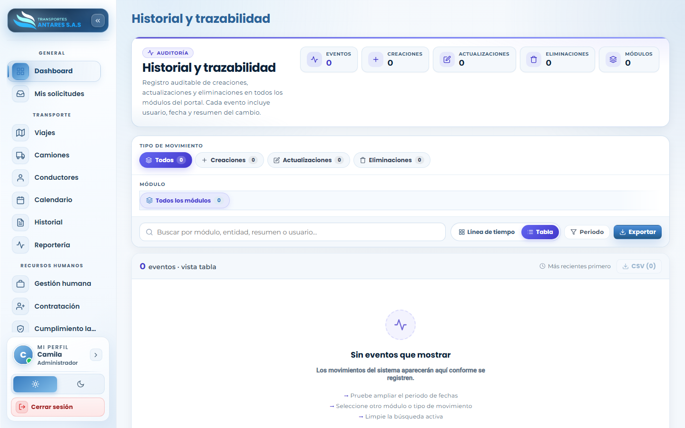

# Manual de usuario — Historial y trazabilidad

[⬅ Volver al índice](./00-introduccion.md)

## 1. Objetivo del módulo

Es el **registro de auditoría** del portal: consolida todas las creaciones, actualizaciones y eliminaciones realizadas en los distintos módulos, indicando quién hizo el cambio, cuándo y un resumen de qué se modificó. Sirve para trazabilidad, control interno y resolución de dudas («¿quién cambió esto y cuándo?»).

**A quién va dirigido:** administradores y equipo de operaciones/RRHH que necesite auditar cambios.

**Acceso:** menú lateral → **Transporte → Historial**.

## 2. Vista general

- **Tarjetas de resumen**: total de eventos, creaciones, actualizaciones, eliminaciones y módulos con actividad.
- **Filtro por tipo de movimiento**: Todos, Creaciones, Actualizaciones, Eliminaciones.
- **Filtro por módulo**: acota los eventos a un módulo puntual (Solicitudes, Viajes, Camiones, Gestión humana, etc.).
- **Buscador**: por módulo, entidad, resumen o usuario responsable.
- **Alternador de vista**: **Línea de tiempo** o **Tabla**, además de un filtro de **Periodo** y el botón **Exportar** (CSV) para descargar el histórico filtrado.

## 3. Paso a paso: consultar quién hizo un cambio

1. Vaya a **Historial**.
2. Seleccione el **módulo** correspondiente en el filtro (por ejemplo, «Camiones» si busca quién editó un vehículo).
3. Opcionalmente, filtre por **tipo de movimiento** (creación, actualización o eliminación).
4. Use el **buscador** para afinar por nombre de entidad o usuario.
5. Ajuste el **periodo** de fechas si el evento ocurrió en una fecha específica.
6. Revise los resultados en la vista **Tabla** (columnas: fecha, usuario, módulo, entidad, resumen del cambio) o en **Línea de tiempo** para una lectura cronológica.

## 4. Exportar el historial

1. Aplique los filtros deseados (módulo, tipo, periodo, búsqueda).
2. Pulse **Exportar → CSV** para descargar el listado filtrado y compartirlo o analizarlo fuera del portal.

## 5. Preguntas frecuentes

- **¿Por qué no veo eventos en el historial?** El historial solo muestra movimientos ocurridos **después** de que el sistema empezó a auditar cada módulo; en un portal recién configurado o sin actividad reciente puede aparecer vacío («Sin eventos que mostrar»).
- **¿Puedo revertir un cambio desde aquí?** No; el historial es de solo lectura. Para corregir un dato, edite el registro directamente desde su módulo de origen.
- **¿Qué diferencia hay con [Centro de reportería](./08-reporteria.md)?** El historial audita **cambios** (quién hizo qué); la reportería analiza **indicadores operativos** (volúmenes, cumplimiento, financieros).

---
[⬅ Anterior: Transporte · Calendario](./06-calendario.md) · [⬅ Volver al índice](./00-introduccion.md) · [Siguiente: Centro de reportería ➡](./08-reporteria.md)
