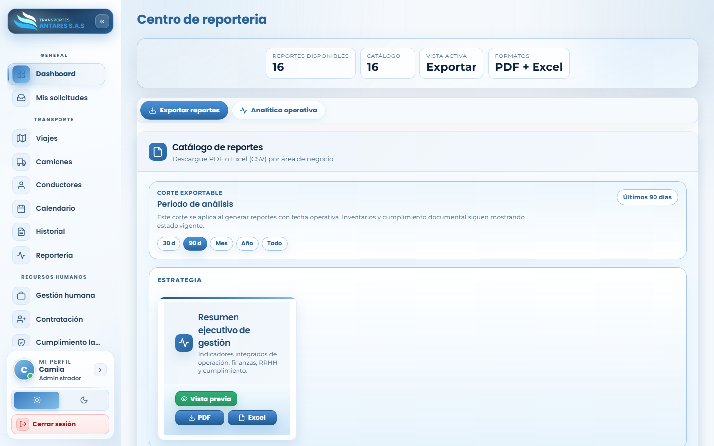
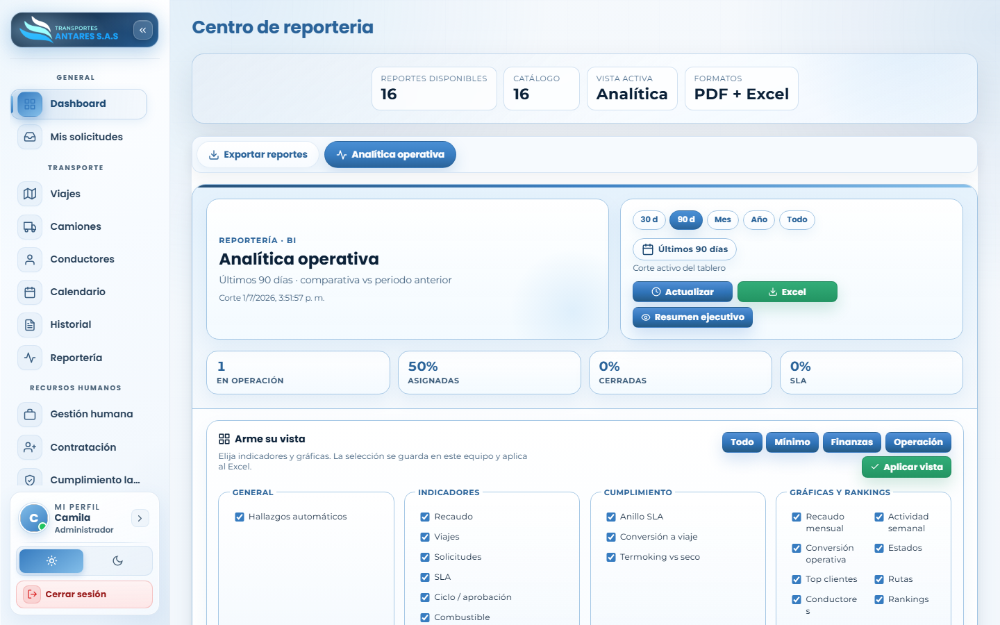

# Manual de usuario — Centro de reportería

[⬅ Volver al índice](./00-introduccion.md)

## 1. Objetivo del módulo

Concentra el **catálogo de reportes** de todas las áreas de negocio (operación, finanzas, RRHH, cumplimiento) y un tablero de **analítica operativa (BI)** configurable, para exportar información en PDF/Excel o visualizar indicadores en pantalla.

**A quién va dirigido:** administradores y equipo de operaciones/dirección.

**Acceso:** menú lateral → **Transporte → Reportería**.

## 2. Vista general — Exportar reportes

- **Tarjetas de resumen**: reportes disponibles, tamaño del catálogo, vista activa y formatos soportados (PDF + Excel).
- **Pestañas**: **Exportar reportes** (catálogo descargable) y **Analítica operativa** (tablero BI en pantalla).
- **Periodo de análisis**: selector rápido (30 días, 90 días, mes, año, todo) que ajusta el corte de fecha para los reportes.
- **Catálogo por categoría** (Estrategia, Operación, Finanzas, RRHH, Cumplimiento...): cada tarjeta de reporte ofrece **Vista previa**, descarga en **PDF** y descarga en **Excel**.

## 3. Paso a paso: descargar un reporte

1. Vaya a **Reportería → Exportar reportes**.
2. Ajuste el **periodo de análisis** si necesita otro rango de fechas distinto al predeterminado.
3. Ubique el reporte deseado (por ejemplo, «Resumen ejecutivo de gestión») y, opcionalmente, pulse **Vista previa** para revisarlo en pantalla.
4. Pulse **PDF** o **Excel** según el formato que necesite. El archivo se descarga a su equipo.

## 4. Paso a paso: usar la analítica operativa (BI)

1. Cambie a la pestaña **Analítica operativa**.

2. Seleccione el rango temporal (**30 d, 90 d, Mes, Año, Todo**) y pulse **Actualizar** para recalcular el tablero, o **Excel** para exportar los datos actuales.
3. Revise los indicadores principales: % en operación, % asignadas, % cerradas y % de cumplimiento SLA.
4. En la sección **Arme su vista**, marque o desmarque los indicadores y gráficas que desea ver (generales, indicadores, cumplimiento, gráficas y rankings) y pulse **Aplicar vista**. La selección se guarda en su equipo y también se aplica a la exportación en Excel.
5. Use **Resumen ejecutivo** para obtener una síntesis narrativa del periodo analizado.

## 5. Preguntas frecuentes

- **¿Los reportes reflejan datos en tiempo real?** Se calculan sobre el periodo de análisis seleccionado y la información sincronizada más reciente del portal.
- **¿Puedo compartir un reporte exportado?** Sí, los archivos PDF/Excel se descargan a su equipo y puede distribuirlos según las políticas internas de la empresa.
- **¿Qué diferencia hay con [Historial y trazabilidad](./07-historial.md)?** La reportería resume **indicadores de negocio**; el historial audita **cambios puntuales** hechos por los usuarios.

---
[⬅ Anterior: Historial y trazabilidad](./07-historial.md) · [⬅ Volver al índice](./00-introduccion.md) · [Siguiente: Gestión humana ➡](./09-gestion-humana.md)
