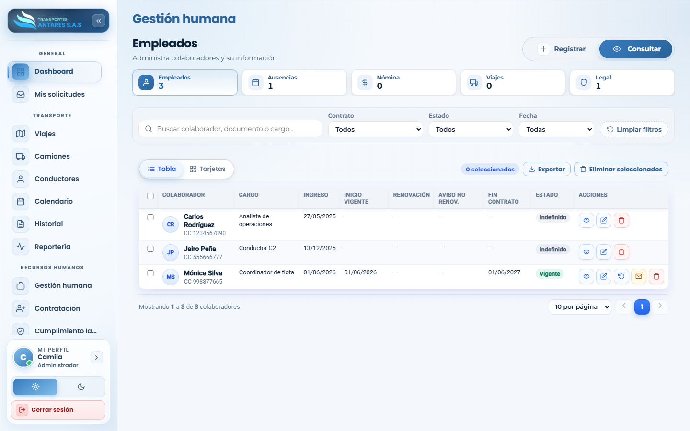
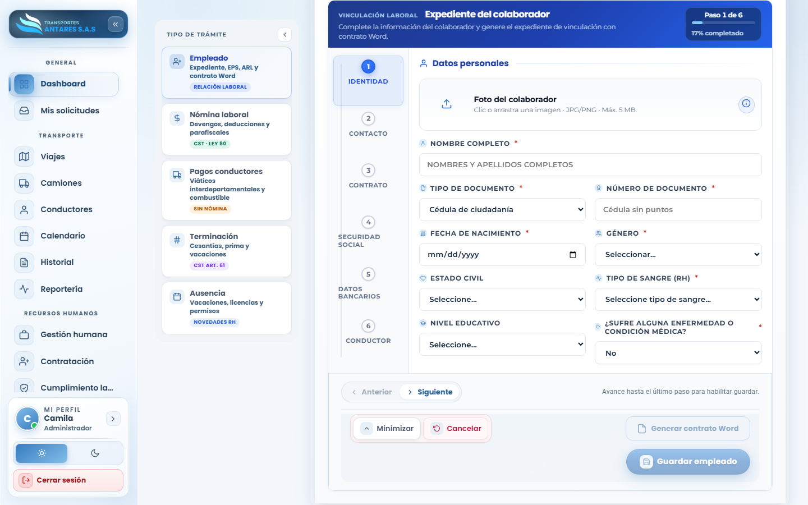
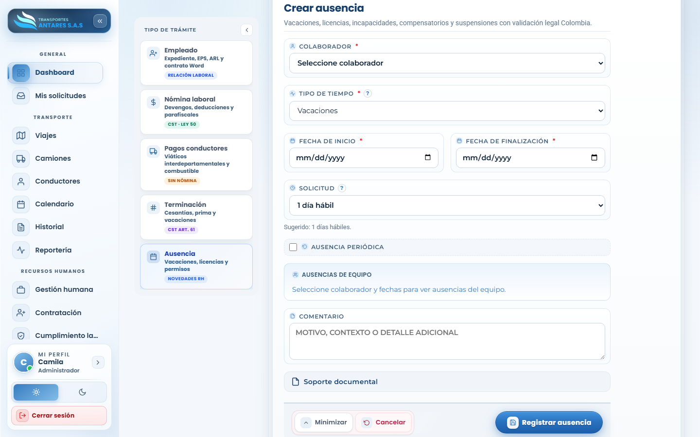

# Manual de usuario — Gestión humana

[⬅ Volver al índice](./00-introduccion.md)

## 1. Objetivo del módulo

Administra el **ciclo completo del talento humano**: alta de colaboradores (empleados y conductores), liquidación de nómina, pagos a conductores por viaje, liquidaciones de terminación de contrato, y el registro de ausencias/incapacidades — todo conforme al Código Sustantivo del Trabajo (CST) y la normativa laboral colombiana.

**A quién va dirigido:** equipo de RRHH y administradores.

**Acceso:** menú lateral → **Recursos humanos → Gestión humana**.

## 2. Vista general — Consultar

- **Tarjetas de resumen**: total de empleados, ausencias registradas, valor de nómina, viajes (pagos a conductores) y alertas legales.
- **Filtros**: por tipo de contrato, estado y fecha.
- **Tabla de colaboradores**: nombre, documento, cargo, fecha de ingreso, inicio de contrato vigente, fecha de renovación/aviso, fin de contrato y estado (Indefinido / Vigente / etc.). Acciones por fila: **ver, editar, carta laboral, contrato, renovar, aviso de no renovación, eliminar**.
- **Exportar**: botón para descargar el listado de colaboradores.

## 3. Paso a paso: registrar un nuevo colaborador

1. Vaya a **Gestión humana → Registrar**. En el panel **Tipo de trámite**, seleccione **Empleado**.
2. Complete el asistente **Expediente del colaborador**, de 6 pasos:

   - **Paso 1 — Identidad**: foto, nombre completo, tipo y número de documento, fecha de nacimiento, género, estado civil, tipo de sangre, nivel educativo y si tiene alguna condición médica.
   - **Paso 2 — Contacto**: teléfono, dirección, ciudad/departamento y contacto de emergencia.
   - **Paso 3 — Contrato**: cargo, tipo de contrato (indefinido, fijo, prestación de servicios), salario base, fecha de ingreso y, si aplica, plazo del contrato a término fijo.
   - **Paso 4 — Seguridad social**: EPS, fondo de pensión y ARL.
   - **Paso 5 — Datos bancarios**: banco y número de cuenta para el pago de nómina.
   - **Paso 6 — Conductor** (si el cargo es de conducción): licencia, categoría y vencimiento.
3. Puede pulsar **Guardar borrador** en cualquier momento para continuar más tarde, o **Generar contrato Word** para producir la plantilla de contrato lista para firma.
4. Al finalizar el último paso, pulse **Guardar empleado**.

## 4. Paso a paso: registrar una ausencia o incapacidad

1. Vaya a **Gestión humana → Registrar** y, en **Tipo de trámite**, seleccione **Ausencia**.

2. Seleccione el **colaborador**, el **tipo de tiempo** (vacaciones, licencia, incapacidad, compensatorio, suspensión), y las fechas de **inicio** y **finalización**. El portal sugiere los días hábiles calculados.
3. Marque **Ausencia periódica** si se repite, adjunte **soporte documental** si aplica (por ejemplo, incapacidad médica) y agregue un comentario.
4. Pulse **Registrar ausencia**. Queda reflejada en el calendario y en la ficha del colaborador.

## 5. Otros trámites disponibles en el panel «Tipo de trámite»

| Trámite | Para qué sirve |
|---|---|
| **Nómina laboral** | Liquidar devengos, deducciones y aportes parafiscales de los colaboradores con relación laboral (CST · Ley 50). |
| **Pagos conductores** | Registrar pagos por prestación de servicios a conductores (viáticos interdepartamentales, combustible), fuera del esquema de nómina tradicional. |
| **Terminación** | Generar la liquidación final de un contrato (cesantías, prima, vacaciones) conforme al CST art. 61. |

## 6. Editar un colaborador

1. En la pestaña **Consultar**, ubique al colaborador en la tabla o tarjetas.
2. Pulse el ícono de **editar** en la columna **Acciones** para actualizar su ficha, o **renovar** para gestionar la renovación de un contrato a término fijo próximo a vencer.

## 7. Generar carta laboral (Colombia)

Desde **Consultar → Colaboradores**, use el botón **Carta laboral** en la fila del colaborador o, dentro de la **Ficha del colaborador**, el mismo botón en las acciones inferiores.

1. Elija el **tipo de documento**:
   - **Constancia de vinculación vigente**: certifica que la persona está vinculada actualmente (trámites bancarios, créditos, visas, etc.).
   - **Certificado laboral al retiro (CST art. 57)**: al terminar la relación laboral; incluye tiempo de servicio, cargo, salario y causa del retiro.
2. Indique la **fecha del documento**, el **destinatario** (por defecto «A quien interese») y, si aplica, **fecha y causa de retiro**.
3. Marque si desea incluir **remuneración** y **afiliaciones a seguridad social** (EPS, pensión, ARL).
4. Seleccione el **formato de descarga**:
   - **Vista previa**: abre una ventana para imprimir o, desde allí, descargar **PDF** o **Word**.
   - **Descargar PDF**: guarda el archivo `.pdf` directamente en su equipo.
   - **Descargar Word**: guarda el archivo `.docx` editable en Microsoft Word o compatible.
5. Pulse **Generar documento**. El archivo incluye automáticamente la **firma digitalizada del representante legal** (la misma usada en contratos y desprendibles de nómina). Estampe el **sello de la empresa** solo si la entidad receptora lo exige.

> **Nota legal:** el contenido sigue el Código Sustantivo del Trabajo y la práctica laboral colombiana. Antes de entregar un certificado de retiro, valide montos, causal y finiquito con su abogado laboral o contador.

## 8. Preguntas frecuentes

- **¿Cómo doy de alta a un conductor?** Regístrelo igual que cualquier colaborador, seleccionando el cargo de tipo «Conductor». Automáticamente aparecerá también en [Transporte · Conductores](./05-conductores.md) para la gestión operativa.
- **¿Cómo genero una carta laboral?** En **Consultar → Colaboradores**, pulse **Carta laboral** en el colaborador. Elija constancia vigente o certificado de retiro, configure los datos y descargue en **PDF**, **Word** o abra la **vista previa** para imprimir.
- **¿Qué pasa si no renuevo un contrato a término fijo a tiempo?** El portal muestra una alerta de «Aviso no renov.» con al menos 30 días de anticipación, conforme a la ley colombiana.
- **¿Dónde se controla el cumplimiento de exámenes médicos y capacitaciones SST?** En el módulo [Cumplimiento laboral y SST](./11-cumplimiento-laboral.md).

---
[⬅ Anterior: Centro de reportería](./08-reporteria.md) · [⬅ Volver al índice](./00-introduccion.md) · [Siguiente: Contratación ➡](./10-contratacion.md)
