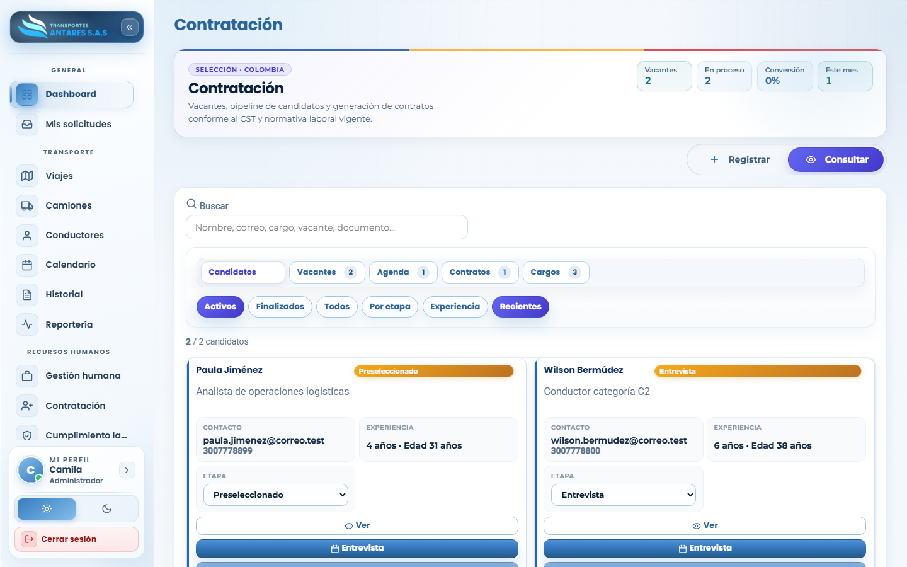
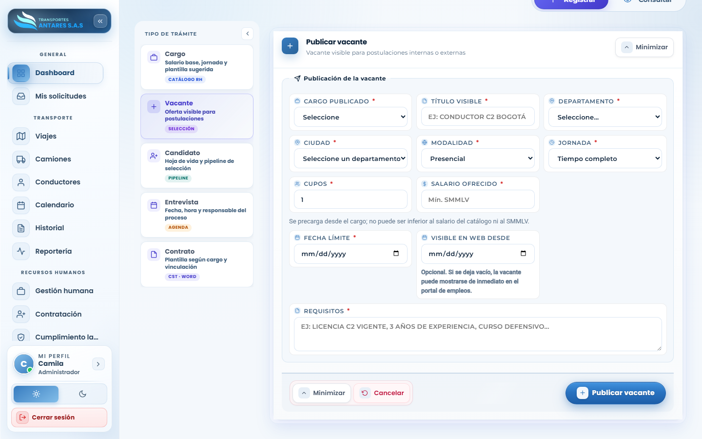
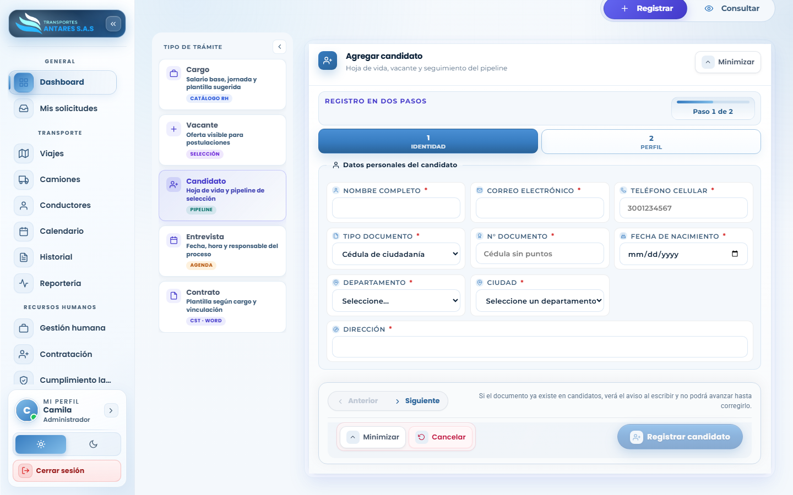
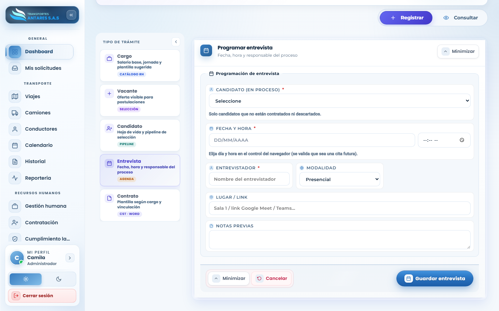

# Manual de usuario — Contratación

[⬅ Volver al índice](./00-introduccion.md)

## 1. Objetivo del módulo

Gestiona el **proceso de selección de personal**: catálogo de cargos, publicación de vacantes, registro y seguimiento de candidatos, programación de entrevistas y generación del contrato final, conforme al CST.

**A quién va dirigido:** equipo de RRHH y administradores.

**Acceso:** menú lateral → **Recursos humanos → Contratación**.

## 2. Vista general — Consultar

- **Tarjetas de resumen**: vacantes abiertas, candidatos en proceso, tasa de conversión y contrataciones del mes.
- **Pestañas de la bandeja**: **Candidatos**, **Vacantes**, **Agenda** (entrevistas), **Contratos**, **Cargos**.
- **Filtros rápidos**: Activos, Finalizados, Todos, Por etapa, Experiencia, Recientes.
- **Tarjeta de candidato**: nombre, etapa del proceso (Preseleccionado, Entrevista, etc.), vacante a la que aplica, contacto y años de experiencia. Incluye los botones **Ver** y **Entrevista**.

## 3. Paso a paso: definir un cargo

1. Vaya a **Contratación → Registrar**. En el panel **Tipo de trámite**, seleccione **Cargo**.
2. Pulse **Abrir formulario** en la tarjeta **Definir cargo**.
3. Complete el nombre del cargo, tipo de trabajador (empleado/conductor), salario base, tipo de contrato por defecto, jornada y nivel de riesgo ARL.
4. Guarde el cargo; quedará disponible en el catálogo para asociarlo a vacantes y a las fichas de colaboradores en [Gestión humana](./09-gestion-humana.md).

## 4. Paso a paso: publicar una vacante

1. En **Tipo de trámite**, seleccione **Vacante**.

2. Complete el formulario **Publicación de la vacante**: cargo publicado, título visible, departamento/ciudad, modalidad (presencial/remota), jornada, número de cupos y salario ofrecido (no puede ser inferior al del catálogo ni al SMMLV).
3. Defina la **fecha límite** de postulación y, opcionalmente, la fecha desde la que será visible en el portal público de empleos.
4. Describa los **requisitos** de la vacante.
5. Pulse **Publicar vacante**.

## 5. Paso a paso: registrar un candidato

1. En **Tipo de trámite**, seleccione **Candidato**.

2. El registro se hace en **2 pasos**:
   - **Paso 1 — Identidad**: nombre completo, correo, teléfono, tipo y número de documento, fecha de nacimiento, departamento/ciudad y dirección.
   - **Paso 2 — Perfil**: vacante a la que aplica, nivel educativo, años de experiencia, salario esperado, disponibilidad y hoja de vida (adjunto).
3. Si el documento ya existe en la base de candidatos, el portal lo advierte de inmediato para evitar duplicados.
4. Pulse **Registrar candidato**.

## 6. Paso a paso: programar una entrevista

1. En **Tipo de trámite**, seleccione **Entrevista**.

2. Seleccione el **candidato** (solo se listan los que están activos en el proceso, sin contratar ni descartar).
3. Indique **fecha y hora** (debe ser una fecha futura), el **entrevistador**, la **modalidad** (presencial/virtual) y el **lugar o enlace**.
4. Agregue notas previas si lo requiere y pulse **Guardar entrevista**. La cita queda visible también en [Transporte · Calendario](./06-calendario.md).

## 7. Generar el contrato

Desde la sección **Contrato** del panel de trámites se genera la plantilla de contrato en Word según el cargo y tipo de vinculación del candidato seleccionado, lista para firma. El contrato finalizado se vincula automáticamente al expediente del colaborador en [Gestión humana](./09-gestion-humana.md).

## 8. Preguntas frecuentes

- **¿Qué pasa cuando contrato a un candidato?** Debe completarse su alta como colaborador en **Gestión humana**, usando los datos ya capturados en el proceso de selección.
- **¿Puedo tener varias vacantes abiertas para el mismo cargo?** Sí, cada vacante es independiente y puede tener su propio número de cupos y fecha límite.
- **¿Cómo descarto un candidato?** Cambie su etapa a un estado de cierre desde la ficha del candidato (pestaña **Candidatos**, botón **Ver**).

---
[⬅ Anterior: Gestión humana](./09-gestion-humana.md) · [⬅ Volver al índice](./00-introduccion.md) · [Siguiente: Cumplimiento laboral y SST ➡](./11-cumplimiento-laboral.md)
