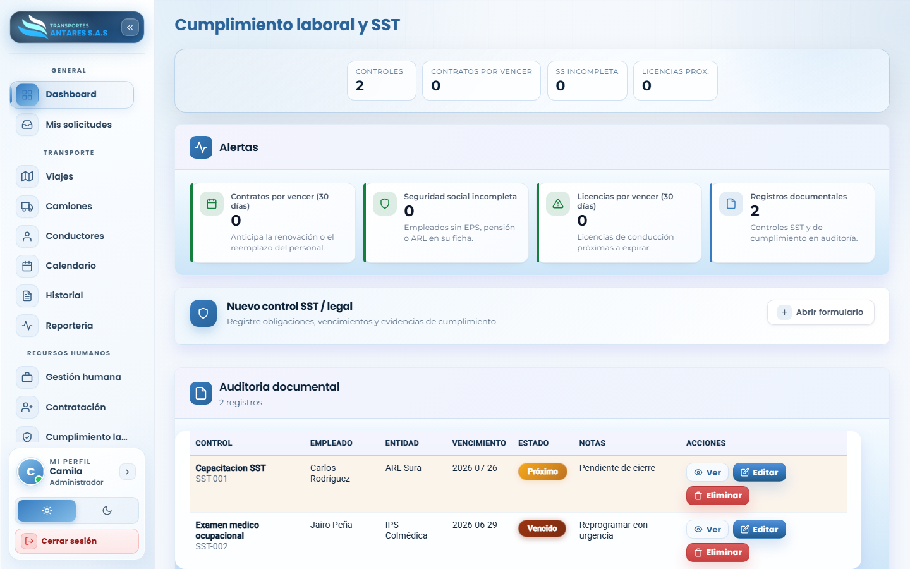
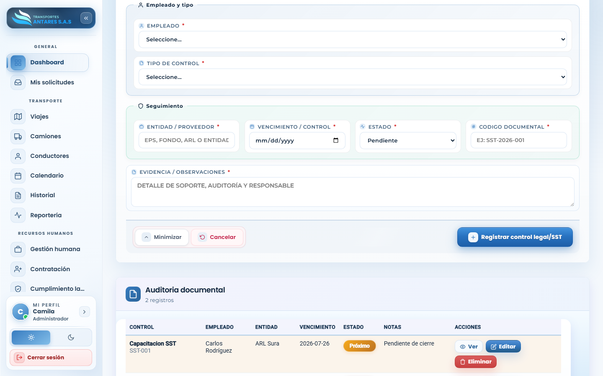

# Manual de usuario — Cumplimiento laboral y SST

[⬅ Volver al índice](./00-introduccion.md)

## 1. Objetivo del módulo

Controla el cumplimiento de obligaciones legales y de **Seguridad y Salud en el Trabajo (SST)**: capacitaciones, exámenes médicos ocupacionales, vencimientos de licencias y otros controles documentales exigidos por la normativa laboral colombiana.

**A quién va dirigido:** equipo de RRHH y administradores.

**Acceso:** menú lateral → **Recursos humanos → Cumplimiento laboral**.

## 2. Vista general

- **Tarjetas de resumen**: controles registrados, contratos por vencer, seguridad social incompleta y licencias próximas a vencer.
- **Panel de alertas**: cuatro tarjetas con el detalle de cada tipo de alerta (contratos por vencer a 30 días, seguridad social incompleta, licencias por vencer, registros documentales totales).
- **Tabla de auditoría documental**: control, empleado, entidad (ARL, EPS, IPS, etc.), fecha de vencimiento, estado (Próximo, Vencido, Al día) y notas. Acciones: **Ver, Editar, Eliminar**.

## 3. Paso a paso: registrar un nuevo control SST o legal

1. Pulse **Abrir formulario** en la tarjeta **Nuevo control SST / legal**.

2. Seleccione el **empleado** y el **tipo de control** (por ejemplo, capacitación SST, examen médico ocupacional, licencia).
3. Indique la **entidad/proveedor** responsable (ARL, EPS, IPS u otra), la **fecha de vencimiento/control** y el **estado** (Pendiente, Próximo, Vencido, Completado).
4. Escriba un **código documental** de referencia y describa la **evidencia u observaciones**.
5. Pulse **Registrar control legal/SST**. El registro aparece en la tabla de auditoría documental y alimenta las alertas del panel.

## 4. Editar o eliminar un control

1. En la tabla de **Auditoría documental**, ubique el control.
2. Pulse **Editar** para actualizar su estado o fecha, o **Eliminar** para retirarlo (requiere confirmación).

## 5. Preguntas frecuentes

- **¿Qué significa el estado «Próximo»?** El control vence dentro de los próximos 30 días; conviene gestionarlo antes de que pase a «Vencido».
- **¿Este módulo reemplaza la afiliación a EPS/ARL de un colaborador?** No; la afiliación básica (EPS, fondo de pensión, ARL) se registra en la ficha del colaborador en [Gestión humana](./09-gestion-humana.md). Este módulo controla capacitaciones, exámenes y otros documentos de cumplimiento SST.
- **¿Quién debe revisar las alertas de este módulo?** Principalmente RRHH, aunque un administrador también puede consultarlas para auditoría general.

---
[⬅ Anterior: Contratación](./10-contratacion.md) · [⬅ Volver al índice](./00-introduccion.md) · [Siguiente: Contacto web (B2B) ➡](./12-contacto-b2b.md)
