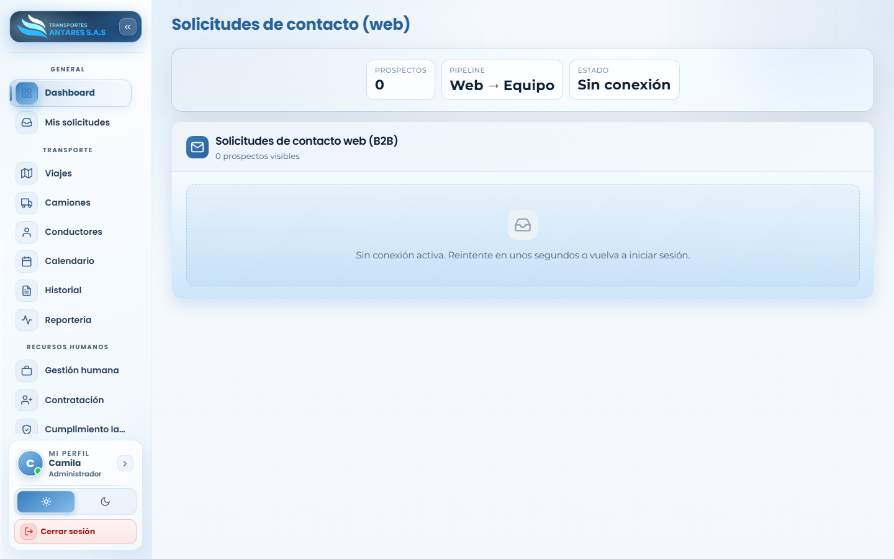

# Manual de usuario — Contacto web (B2B)

[⬅ Volver al índice](./00-introduccion.md)

## 1. Objetivo del módulo

Muestra la **bandeja de prospectos comerciales** que llegan desde el formulario de contacto del sitio web público de Transportes Antares. Es una vista de **solo lectura** pensada para que el equipo comercial priorice y contacte a cada prospecto por correo o teléfono.

**A quién va dirigido:** equipo comercial y administradores.

**Acceso:** menú lateral → **General → Contacto B2B** (visible según permisos).

## 2. Vista general

- **Tarjetas de resumen**: número de prospectos recibidos, el flujo del pipeline («Web → Equipo») y el estado de la conexión con el sitio web (Activo / Sin conexión).
- **Bandeja comercial**: mosaico de tarjetas, una por cada solicitud de contacto recibida, ordenadas de la más reciente a la más antigua.

> Este módulo depende de una conexión activa con el servicio que recibe los formularios del sitio web. Si ve el mensaje **«Sin conexión activa. Reintente en unos segundos o vuelva a iniciar sesión»**, significa que el portal no pudo sincronizar los prospectos en ese momento; recargue la página o inténtelo de nuevo más tarde.

## 3. Qué información trae cada prospecto

Cada tarjeta de la bandeja incluye:

- Nombre y empresa del contacto.
- Tipo de servicio y tipo de operación de interés (chips en la parte superior).
- Correo electrónico y teléfono (con enlaces directos `mailto:` y `tel:` para contactar en un clic).
- Cargo del contacto, NIT de la empresa, frecuencia de envíos esperada e inicio esperado del servicio.
- El **brief** o mensaje libre que el prospecto escribió en el formulario del sitio web.

## 4. Paso a paso: gestionar un prospecto nuevo

1. Ingrese a **Contacto B2B** y revise la bandeja, priorizando por fecha (los más recientes aparecen primero).
2. Lea el **brief de la solicitud** para entender la necesidad del prospecto (tipo de carga, frecuencia, fechas).
3. Use los enlaces de **correo** o **teléfono** de la tarjeta para iniciar el contacto comercial directamente desde su equipo.
4. Una vez contactado y calificado, continúe el proceso de vinculación comercial fuera del portal (por ejemplo, creando la empresa cliente y dando de alta su primer usuario desde [Usuarios y permisos](./13-usuarios-permisos.md)).

## 5. Preguntas frecuentes

- **¿Puedo responder o marcar un prospecto como atendido desde aquí?** No; este módulo es una bandeja de solo lectura. El seguimiento comercial se realiza fuera del portal (correo, CRM, llamada).
- **¿Por qué no veo ningún prospecto?** Puede ser que aún no se haya recibido ninguna solicitud desde el sitio web, o que la sincronización con el servicio esté temporalmente caída (mensaje «Sin conexión»).
- **¿Quién puede ver este módulo?** Solo los usuarios con el permiso «Ver contactos B2B» asignado desde [Usuarios y permisos](./13-usuarios-permisos.md).

---
[⬅ Anterior: Cumplimiento laboral y SST](./11-cumplimiento-laboral.md) · [⬅ Volver al índice](./00-introduccion.md) · [Siguiente: Usuarios y permisos ➡](./13-usuarios-permisos.md)
