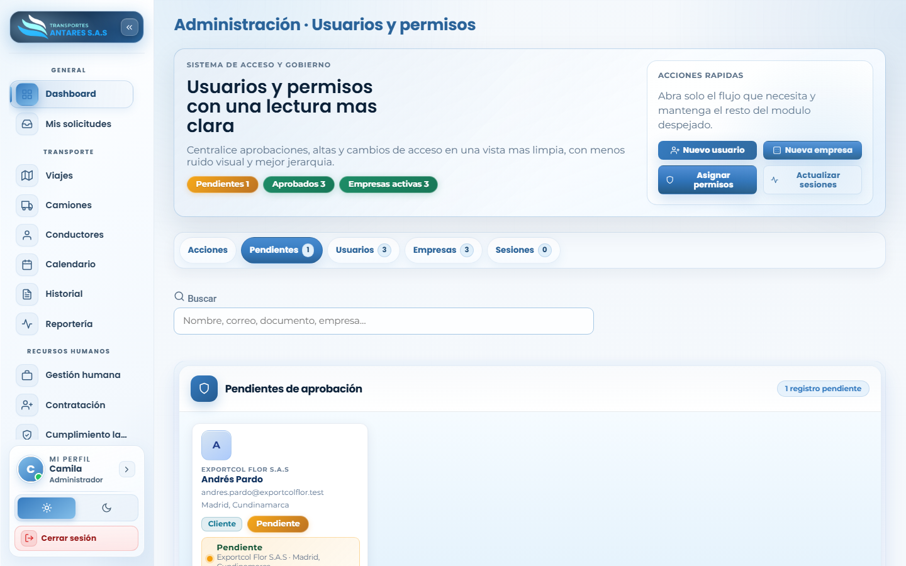
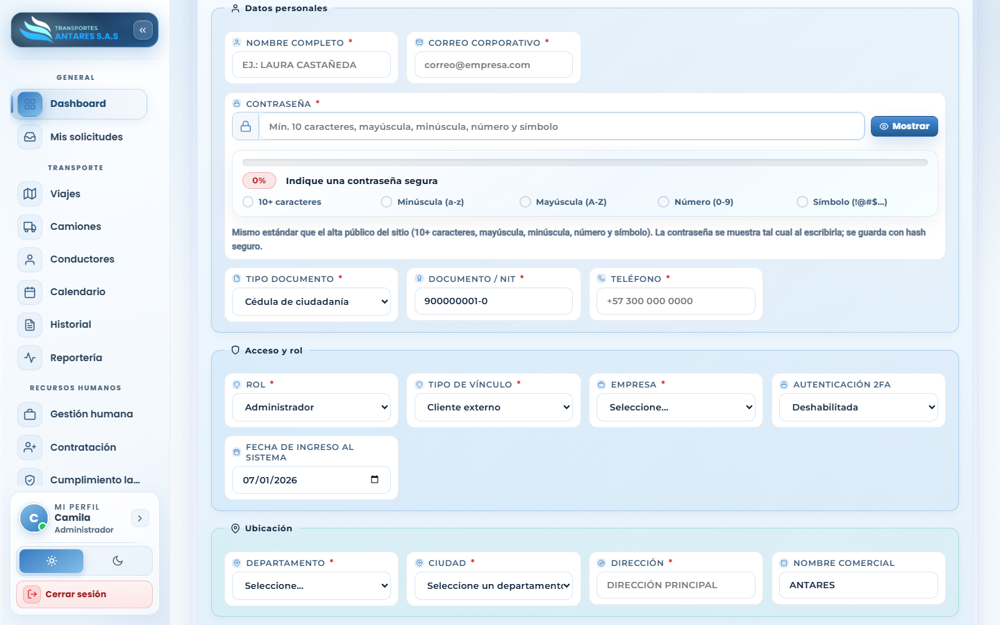
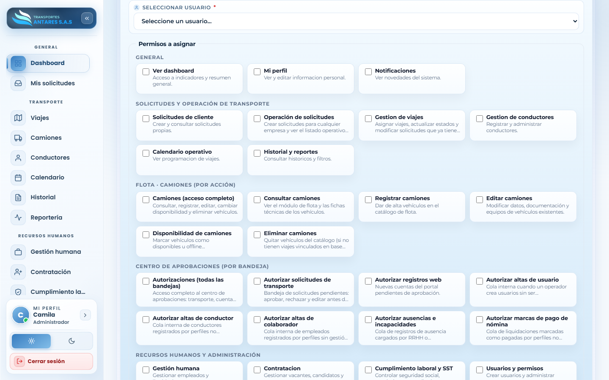

# Manual de usuario — Usuarios y permisos

[⬅ Volver al índice](./00-introduccion.md)

## 1. Objetivo del módulo

Es el panel de **administración de acceso** del portal: gestiona usuarios, empresas, sesiones activas y la asignación fina de permisos por módulo y acción.

**A quién va dirigido:** exclusivamente administradores del sistema.

**Acceso:** menú lateral → **Sistema → Usuarios y permisos**.

## 2. Vista general

- **Tarjetas de resumen**: pendientes de aprobación, usuarios aprobados y empresas activas.
- **Acciones rápidas**: **Nuevo usuario**, **Nueva empresa**, **Asignar permisos**, **Actualizar sesiones**.
- **Pestañas**: **Acciones**, **Pendientes**, **Usuarios**, **Empresas**, **Sesiones**.
- **Buscador**: por nombre, correo, documento o empresa.
- **Pestaña Pendientes**: lista las cuentas registradas desde el sitio público que están a la espera de aprobación de un administrador, con sus datos básicos y los botones para aprobar/rechazar.

## 3. Paso a paso: crear un usuario manualmente

1. Pulse **Nuevo usuario** (acción rápida o botón de la pestaña **Acciones**).

2. Complete **Datos personales**: nombre completo, correo corporativo y una contraseña que cumpla el estándar de seguridad (mínimo 10 caracteres, mayúscula, minúscula, número y símbolo). Indique también tipo de documento, número y teléfono.
3. Complete **Acceso y rol**: seleccione el **rol** (Administrador, Cliente, RRHH, etc.), el **tipo de vínculo**, la **empresa** asociada, si requiere **autenticación 2FA** y la **fecha de ingreso al sistema**.
4. Complete **Ubicación**: departamento, ciudad, dirección y nombre comercial si aplica.
5. Guarde el formulario. El usuario queda creado y, según el rol, con acceso inmediato o pendiente de primer inicio de sesión.

## 4. Paso a paso: aprobar una cuenta registrada desde el sitio web

1. Vaya a la pestaña **Pendientes**.
2. Revise los datos de la solicitud (nombre, correo, empresa, ciudad).
3. Pulse **Aprobar** para activar la cuenta y asignarla a la empresa correspondiente, o **Rechazar** si la solicitud no es válida.

> Este mismo flujo también puede gestionarse desde el módulo [Centro de aprobaciones (Autorizaciones)](./14-autorizaciones.md), que centraliza todas las bandejas de aprobación del portal.

## 5. Paso a paso: asignar permisos a un usuario

1. Pulse **Asignar permisos** (acción rápida).

2. **Seleccione el usuario** al que desea configurar el acceso.
3. Marque los permisos requeridos, organizados por categoría:
   - **General**: ver dashboard, mi perfil, notificaciones.
   - **Solicitudes y operación de transporte**: solicitudes de cliente, operación de solicitudes, gestión de viajes, gestión de conductores, calendario operativo, historial y reportes.
   - **Flota · Camiones (por acción)**: acceso completo, consultar, registrar, editar, marcar disponibilidad, eliminar.
   - **Centro de aprobaciones (por bandeja)**: todas las bandejas, autorizar solicitudes de transporte, autorizar altas de usuario/conductor, autorizar ausencias e incapacidades, autorizar marcas de pago de nómina.
   - **Recursos humanos y administración**: gestión humana, contratación, cumplimiento laboral y SST, usuarios y permisos.
4. Guarde los cambios. El usuario verá reflejados los nuevos accesos la próxima vez que recargue el portal.

## 6. Gestión de empresas y sesiones

- **Nueva empresa**: registra una empresa cliente o propia (NIT, contacto, ciudad, logo) para asociarla a usuarios y solicitudes.
- **Pestaña Sesiones**: muestra las sesiones activas del portal; el botón **Actualizar sesiones** refresca el listado, útil para verificar accesos sospechosos o forzar el cierre de una sesión.

## 7. Preguntas frecuentes

- **¿Qué diferencia hay entre un rol y un permiso?** El **rol** define un conjunto de accesos por defecto (Administrador, Cliente, RRHH...); los **permisos** permiten ajustar ese acceso de forma individual y más granular.
- **¿Puedo quitarle un permiso puntual a un administrador?** Sí, use **Asignar permisos** y desmarque la casilla correspondiente para ese usuario.
- **¿Qué pasa si rechazo una cuenta pendiente?** El registro queda marcado como rechazado y esa persona no podrá iniciar sesión con esas credenciales.

---
[⬅ Anterior: Contacto web (B2B)](./12-contacto-b2b.md) · [⬅ Volver al índice](./00-introduccion.md) · [Siguiente: Centro de aprobaciones ➡](./14-autorizaciones.md)
