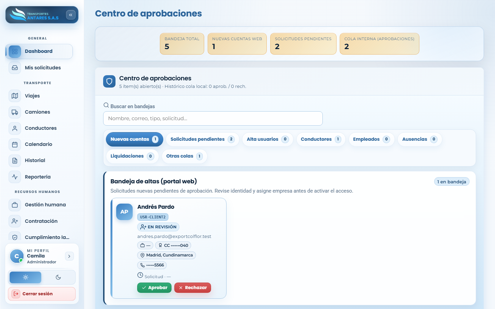

# Manual de usuario — Centro de aprobaciones (Autorizaciones)

[⬅ Volver al índice](./00-introduccion.md)

## 1. Objetivo del módulo

Centraliza **todas las bandejas de aprobación** del portal en un solo lugar: altas de cuentas del sitio web, solicitudes de transporte pendientes, altas de usuarios/conductores/empleados creadas por roles sin permiso directo, ausencias, y marcas de liquidaciones, entre otras.

**A quién va dirigido:** administradores y roles con permiso de aprobación asignado.

**Acceso:** menú lateral → **Sistema → Autorizaciones**.

## 2. Vista general

- **Tarjetas de resumen**: bandeja total, nuevas cuentas web, solicitudes pendientes y cola interna de aprobaciones.
- **Buscador**: por nombre, correo, tipo de trámite o solicitud.
- **Pestañas de bandeja**: **Nuevas cuentas**, **Solicitudes pendientes**, **Alta usuarios**, **Conductores**, **Empleados**, **Ausencias**, **Liquidaciones**, **Otras colas** — cada una con su contador de pendientes.
- **Tarjeta de pendiente**: nombre del solicitante, tipo de trámite, correo, documento, empresa/ubicación, teléfono y fecha de la solicitud. Incluye los botones **Aprobar** y **Rechazar**.

## 3. Paso a paso: aprobar o rechazar una solicitud pendiente

1. Elija la bandeja correspondiente (por ejemplo, **Nuevas cuentas** para altas de usuarios del sitio público, o **Conductores** para altas de conductores creadas por un cliente/operador sin permiso directo).
2. Revise la información del solicitante en la tarjeta.
3. Pulse **Aprobar** para activar el registro (esto crea o habilita el usuario/conductor/empleado/solicitud correspondiente en su módulo de origen), o **Rechazar** si la solicitud no procede.
4. El sistema retira la tarjeta de la bandeja de pendientes una vez resuelta.

## 4. Qué representa cada bandeja

| Bandeja | Qué aprueba |
|---|---|
| **Nuevas cuentas** | Registros hechos desde el formulario público de acceso al portal. |
| **Solicitudes pendientes** | Solicitudes de transporte a la espera de revisión/asignación. |
| **Alta usuarios** | Creación de usuarios internos hecha por un rol sin permiso de creación directa. |
| **Conductores** | Altas de conductores registradas por operación/clientes sin permiso administrativo pleno. |
| **Empleados** | Altas de colaboradores pendientes de validación. |
| **Ausencias** | Solicitudes de ausencia/incapacidad que requieren visto bueno. |
| **Liquidaciones** | Marcas de pago de nómina pendientes de confirmación. |
| **Otras colas** | Trámites adicionales que no encajan en las categorías anteriores. |

## 5. Preguntas frecuentes

- **¿Quién puede aprobar en este módulo?** Solo usuarios con el permiso correspondiente a cada bandeja, asignado desde [Usuarios y permisos](./13-usuarios-permisos.md).
- **¿Qué pasa si rechazo una solicitud por error?** Debe pedir al solicitante que la registre nuevamente; el rechazo no es reversible desde este módulo.
- **¿Este módulo reemplaza la pestaña «Pendientes» de Usuarios y permisos?** No, la complementa: el Centro de aprobaciones consolida **todas** las colas del portal en un solo lugar, mientras que la pestaña de Usuarios y permisos se enfoca solo en cuentas de usuario.

---
[⬅ Anterior: Usuarios y permisos](./13-usuarios-permisos.md) · [⬅ Volver al índice](./00-introduccion.md) · [Siguiente: Notificaciones ➡](./15-notificaciones.md)
