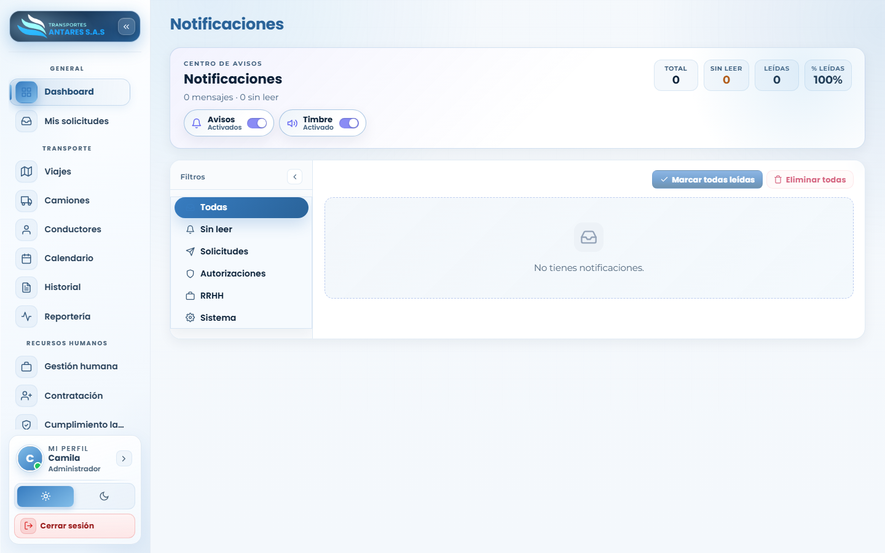

# Manual de usuario — Notificaciones

[⬅ Volver al índice](./00-introduccion.md)

## 1. Objetivo del módulo

Es la **bandeja de avisos** personales del usuario: solicitudes nuevas, aprobaciones, vencimientos de documentos, novedades de RRHH y avisos del sistema, con control sobre alertas emergentes y sonido.

**A quién va dirigido:** todos los roles del portal.

**Acceso:** menú lateral → **General → Notificaciones** (también accesible desde la campana de notificaciones, si su vista la incluye).

## 2. Vista general

- **Tarjetas de resumen**: total de mensajes, sin leer, leídas y porcentaje de lectura.
- **Interruptores de preferencia**: **Avisos** (activa/desactiva las ventanas emergentes) y **Timbre** (activa/desactiva el sonido de notificación). La bandeja conserva el historial aunque los avisos estén desactivados.
- **Filtros laterales**: Todas, Sin leer, Solicitudes, Autorizaciones, RRHH, Sistema.
- **Acciones de la bandeja**: **Marcar todas leídas** y **Eliminar todas**.
- **Listado**: cada notificación muestra título, cuerpo del mensaje y fecha, agrupadas por periodo (hoy, ayer, esta semana, etc.).

## 3. Paso a paso: revisar y gestionar notificaciones

1. Ingrese a **Notificaciones** y use los filtros laterales para acotar por categoría (por ejemplo, «Autorizaciones» para ver solo avisos de aprobaciones pendientes).
2. Haga clic sobre una notificación para marcarla como leída y, si aplica, ir directamente al módulo relacionado.
3. Use **Marcar todas leídas** para limpiar el contador de pendientes de una sola vez.
4. Use **Eliminar todas** si desea vaciar por completo el historial de la bandeja (acción irreversible).

## 4. Configurar preferencias de aviso

1. Active o desactive el interruptor **Avisos** para recibir (o no) ventanas emergentes en pantalla cuando llegue una notificación nueva.
2. Active o desactive el interruptor **Timbre** para escuchar (o silenciar) el sonido asociado a los avisos emergentes.
3. Estos ajustes se guardan en su sesión/equipo y no afectan lo que otros usuarios reciben.

## 5. Preguntas frecuentes

- **¿Por qué mi bandeja aparece vacía?** Verá el mensaje «No tienes notificaciones» cuando no existan avisos nuevos generados para su usuario; la bandeja se llena automáticamente a medida que ocurren eventos relevantes (nuevas solicitudes, aprobaciones, vencimientos, etc.).
- **¿Puedo recuperar una notificación eliminada?** No; **Eliminar todas** borra el historial de forma permanente.
- **¿Las notificaciones son las mismas para todos los usuarios?** No; cada usuario recibe únicamente los avisos relevantes para su rol y su empresa (o, en el caso de administradores/RRHH, los avisos de audiencia ampliada que les correspondan).

---
[⬅ Anterior: Centro de aprobaciones](./14-autorizaciones.md) · [⬅ Volver al índice](./00-introduccion.md) · [Siguiente: Mi perfil ➡](./16-mi-perfil.md)
