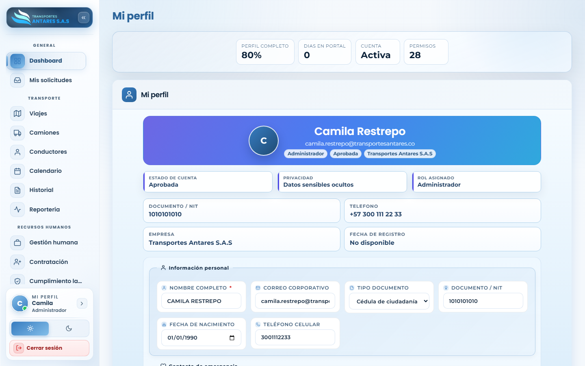

# Manual de usuario — Mi perfil

[⬅ Volver al índice](./00-introduccion.md)

## 1. Objetivo del módulo

Permite a cada usuario **consultar y actualizar su propia información** dentro del portal: datos personales, contacto de emergencia y datos de la cuenta (rol, empresa, estado).

**A quién va dirigido:** todos los roles del portal.

**Acceso:** menú lateral → tarjeta de sesión (parte inferior) → **Mi perfil**.

## 2. Vista general

- **Tarjetas de resumen**: porcentaje de perfil completo, días de antigüedad en el portal, estado de la cuenta (Activa) y número de permisos asignados.
- **Tarjeta de identidad**: nombre, correo, y etiquetas de rol, estado de aprobación y empresa.
- **Datos de solo lectura**: estado de cuenta, nivel de privacidad de datos sensibles, rol asignado, documento/NIT, teléfono, empresa y fecha de registro.
- **Formulario editable — Información personal**: nombre completo, correo corporativo, tipo y número de documento, fecha de nacimiento y teléfono celular.
- **Contacto de emergencia** (más abajo en la pantalla): nombre, teléfono y relación del contacto de emergencia.

## 3. Paso a paso: actualizar mis datos personales

1. Vaya a **Mi perfil**.
2. En la sección **Información personal**, actualice los campos que necesite (por ejemplo, teléfono celular o correo).
3. Desplácese hasta **Contacto de emergencia** y actualice esos datos si es necesario.
4. Guarde los cambios con el botón de guardar del formulario.

## 4. Preguntas frecuentes

- **¿Puedo cambiar mi propio rol desde aquí?** No; el rol y los permisos solo pueden ser modificados por un administrador desde [Usuarios y permisos](./13-usuarios-permisos.md).
- **¿Qué significa «Perfil completo»?** Es un porcentaje que indica cuántos de los campos recomendados de su ficha ha diligenciado; complételo para tener una ficha más útil en caso de contacto de emergencia o verificación de identidad.
- **¿Dónde cambio mi contraseña?** Use la opción correspondiente dentro de esta misma pantalla o el flujo de «¿Olvidó su contraseña?» desde el modal de acceso si no la recuerda.
- **¿Puedo ver mis solicitudes o notificaciones desde mi perfil?** No directamente; use los módulos [Mis solicitudes](./02-solicitudes.md) y [Notificaciones](./15-notificaciones.md).

---
[⬅ Anterior: Notificaciones](./15-notificaciones.md) · [⬅ Volver al índice](./00-introduccion.md)
